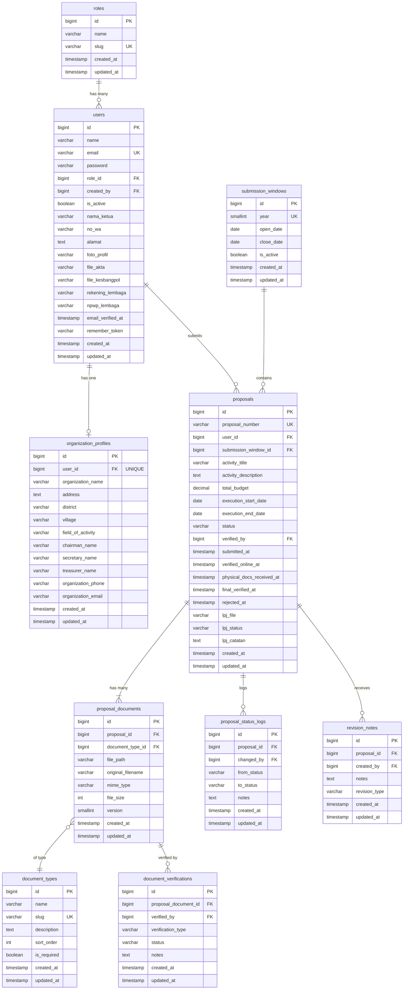

# ARCHITECTURE.md
# Portal e-Hibah Kesra — Technical Architecture Reference

> **Tujuan dokumen**: Single source of truth teknis untuk seluruh sesi development. Setiap AI coding agent atau developer yang membuka project ini harus membaca dokumen ini terlebih dahulu sebelum menulis kode.
>
> **Tanggal**: 12 September 2026
> **Referensi**: PRD v1.0 (8 September 2026)

---

## 1. Overview Arsitektur

### 1.1 Arsitektur Monolith + API Terpisah

```
┌─────────────────────────────────────────────────────┐
│                   Laravel Application                │
│                                                      │
│  ┌──────────────────────┐  ┌──────────────────────┐  │
│  │    Web (Inertia.js)  │  │    API (/api prefix)  │  │
│  │                      │  │                       │  │
│  │  • Auth: Session     │  │  • Auth: Sanctum      │  │
│  │    (Laravel Breeze)  │  │    (Token-based)      │  │
│  │  • Guard: web        │  │  • Guard: sanctum     │  │
│  │  • Response: Inertia │  │  • Response: JSON     │  │
│  │  • Untuk: Browser    │  │  • Untuk: Mobile app  │  │
│  │                      │  │  • Read-only (3 EP)   │  │
│  └──────────┬───────────┘  └──────────┬────────────┘  │
│             │                         │               │
│             ▼                         ▼               │
│  ┌────────────────────────────────────────────────┐   │
│  │              Shared Business Logic             │   │
│  │  Models, States, Policies, Services, Notifs    │   │
│  └────────────────────────┬───────────────────────┘   │
│                           │                           │
│                           ▼                           │
│                    ┌─────────────┐                    │
│                    │   MySQL 8   │                    │
│                    └─────────────┘                    │
│                                                      │
│                 ┌──────────────────┐                  │
│                 │  Private Disk    │                  │
│                 │  (storage/app/   │                  │
│                 │   private/)      │                  │
│                 └──────────────────┘                  │
└─────────────────────────────────────────────────────┘

       ┌────────────┐              ┌──────────────┐
       │  Browser   │──Inertia───▶│  Vue 3 SPA   │
       │  (Desktop/ │  (XHR +     │  (Composition │
       │   Tablet)  │   partial   │   API)        │
       └────────────┘   reload)   └──────────────┘

       ┌────────────┐
       │  Android   │───REST API──▶ /api/*
       │  App       │  (JSON +
       └────────────┘   Sanctum)
```

### 1.2 Kenapa Arsitektur Ini

- **1 codebase** — tidak perlu maintain backend terpisah untuk web dan API. Controller web dan API terpisah, tapi model/service/policy sama.
- **Inertia.js** — no full-page reload, tapi tanpa kompleksitas SPA routing manual (Vue Router). Laravel tetap menangani routing.
- **API minimal** — hanya 3 endpoint read-only untuk mobile. Tidak perlu API lengkap yang mirror seluruh fitur web.

### 1.3 Tech Stack Final

| Layer | Teknologi | Versi Target |
|---|---|---|
| Backend | Laravel | 11.x |
| Frontend Bridge | Inertia.js | 2.x |
| Frontend | Vue.js (Composition API) | 3.x |
| CSS | Tailwind CSS | 4.x (via Breeze) |
| Database | MySQL | 8.x |
| Auth Web | Laravel Breeze (Inertia + Vue) | Latest |
| Auth API | Laravel Sanctum | Built-in Laravel 11 |
| State Machine | spatie/laravel-model-states | 2.x |
| Build Tool | Vite | Via Breeze |
| Dev Environment | Laragon (Windows) | Latest |

---

## 2. Struktur Folder Lengkap

### 2.1 Backend (`app/`)

```
app/
├── Enums/
│   ├── ProposalStatus.php          # Backed enum: 7 status proposal
│   └── LpjStatus.php               # Backed enum: 3 status LPJ (menunggu, revisi, diterima)
│
├── Http/
│   ├── Controllers/
│   │   ├── Auth/                    # Dari Breeze (RegisteredUserController customized)
│   │   │   ├── AuthenticatedSessionController.php
│   │   │   ├── RegisteredUserController.php    # Customized: tambah field institusional
│   │   │   ├── PasswordResetLinkController.php
│   │   │   ├── NewPasswordController.php
│   │   │   ├── EmailVerificationPromptController.php
│   │   │   ├── VerifyEmailController.php
│   │   │   └── EmailVerificationNotificationController.php
│   │   │
│   │   ├── Pengaju/                 # Controller khusus role Pengaju
│   │   │   ├── DashboardController.php
│   │   │   ├── ProposalController.php         # CRUD proposal + submit + resubmit
│   │   │   ├── DocumentUploadController.php   # Upload 11 dokumen + revisi
│   │   │   ├── LpjController.php              # Upload & lihat status LPJ
│   │   │   └── ProfileController.php          # Profil organisasi + berkas legalitas
│   │   │
│   │   ├── AdminKesra/              # Controller khusus role Admin Kesra
│   │   │   ├── DashboardController.php
│   │   │   ├── VerificationController.php     # Verifikasi online per-dokumen
│   │   │   ├── PhysicalArchiveController.php  # Verifikasi fisik/offline
│   │   │   ├── LpjVerificationController.php  # Verifikasi LPJ
│   │   │   ├── PengajuListController.php      # Daftar & profil pengaju
│   │   │   └── SubmissionWindowController.php # CRUD jendela pengajuan
│   │   │
│   │   ├── SuperAdmin/              # Controller khusus role Super Admin
│   │   │   ├── DashboardController.php
│   │   │   └── AdminKesraManagementController.php  # CRUD akun Admin Kesra
│   │   │
│   │   ├── FileController.php       # Serve file dari disk privat (semua role)
│   │   └── NotificationController.php  # Mark as read, list notifikasi
│   │
│   ├── Middleware/
│   │   └── CheckRole.php            # Validasi role user (parameter: slug dipisah koma)
│   │
│   └── Requests/                    # Form Request per aksi
│       ├── Auth/
│       │   └── RegisterRequest.php  # Validasi registrasi Pengaju (field institusional)
│       ├── Pengaju/
│       │   ├── StoreProposalRequest.php
│       │   ├── UpdateProposalRequest.php
│       │   ├── UploadDocumentRequest.php
│       │   ├── SubmitProposalRequest.php
│       │   ├── UploadLpjRequest.php
│       │   └── UpdateProfileRequest.php
│       ├── AdminKesra/
│       │   ├── VerifyDocumentRequest.php
│       │   ├── VerifyPhysicalRequest.php
│       │   ├── RejectProposalRequest.php
│       │   ├── VerifyLpjRequest.php
│       │   └── StoreSubmissionWindowRequest.php
│       └── SuperAdmin/
│           └── StoreAdminKesraRequest.php
│
├── Models/
│   ├── User.php
│   ├── Role.php
│   ├── OrganizationProfile.php
│   ├── Proposal.php                 # Menggunakan HasStates trait (spatie)
│   ├── SubmissionWindow.php
│   ├── DocumentType.php
│   ├── ProposalDocument.php
│   ├── DocumentVerification.php
│   ├── RevisionNote.php
│   └── ProposalStatusLog.php
│
├── States/                          # spatie/laravel-model-states
│   └── ProposalStatus/
│       ├── ProposalStatusState.php  # Abstract base class
│       ├── Draft.php
│       ├── Diajukan.php
│       ├── VerifikasiOnline.php
│       ├── PerluRevisi.php
│       ├── MenungguBerkasFisik.php
│       ├── VerifikasiFinal.php
│       ├── Ditolak.php
│       └── Transitions/             # Custom transition classes (opsional)
│           └── ProposalTransition.php  # Base transition yang otomatis log ke audit trail
│
├── Policies/
│   ├── ProposalPolicy.php           # Otorisasi akses proposal per role
│   ├── ProposalDocumentPolicy.php   # Otorisasi akses/download dokumen
│   ├── LpjPolicy.php               # Otorisasi upload/verifikasi LPJ
│   └── UserPolicy.php              # Otorisasi CRUD user (Super Admin only)
│
├── Notifications/
│   ├── ProposalSubmittedNotification.php     # → semua Admin Kesra
│   ├── LpjVerifiedNotification.php           # → Pengaju terkait
│   └── LpjRevisionRequestedNotification.php  # → Pengaju terkait
│
├── Services/
│   ├── ProposalService.php          # Logika bisnis: buat proposal, generate nomor, cek jendela
│   ├── DocumentService.php          # Upload, versioning, serve file
│   └── VerificationService.php      # Logika verifikasi dokumen + transisi status
│
├── Observers/
│   └── ProposalObserver.php         # Listen state changes → tulis ke proposal_status_logs
│
└── Providers/
    └── AppServiceProvider.php       # Register observer, custom boot logic
```

### 2.2 Frontend (`resources/js/`)

```
resources/js/
├── app.js                           # Inertia app bootstrap
├── bootstrap.js                     # Axios defaults
│
├── Layouts/
│   ├── AuthenticatedLayout.vue      # Layout utama (sidebar + header + notif)
│   ├── GuestLayout.vue              # Layout login/register
│   ├── PengajuLayout.vue            # Extends Authenticated, sidebar menu Pengaju
│   ├── AdminKesraLayout.vue         # Extends Authenticated, sidebar menu Admin Kesra
│   └── SuperAdminLayout.vue         # Extends Authenticated, sidebar menu Super Admin
│
├── Pages/
│   ├── Auth/                        # Dari Breeze (customized)
│   │   ├── Login.vue
│   │   ├── Register.vue             # Customized: field institusional
│   │   ├── ForgotPassword.vue
│   │   ├── ResetPassword.vue
│   │   └── VerifyEmail.vue
│   │
│   ├── Pengaju/
│   │   ├── Dashboard.vue            # Stepper + alert + riwayat
│   │   ├── Profile/
│   │   │   └── Edit.vue             # Profil organisasi + upload legalitas
│   │   └── Proposals/
│   │       ├── Index.vue            # Daftar proposal sendiri
│   │       ├── Create.vue           # Form buat proposal
│   │       ├── Edit.vue             # Edit draft
│   │       ├── Show.vue             # Detail + checklist dokumen + upload
│   │       └── Lpj.vue              # Upload & status LPJ
│   │
│   ├── AdminKesra/
│   │   ├── Dashboard.vue            # 4 kartu statistik + tabel terbaru + LPJ pending
│   │   ├── Verification/
│   │   │   ├── Index.vue            # Daftar proposal perlu verifikasi
│   │   │   └── Show.vue             # Detail + verifikasi per dokumen
│   │   ├── PhysicalArchive/
│   │   │   └── Index.vue            # Arsip berkas fisik + pencarian
│   │   ├── Lpj/
│   │   │   ├── Index.vue            # Daftar LPJ pending
│   │   │   └── Show.vue             # Detail + verifikasi LPJ
│   │   ├── Pengaju/
│   │   │   ├── Index.vue            # Daftar semua pengaju
│   │   │   └── Profile.vue          # Profil pengaju + riwayat proposal
│   │   ├── SubmissionWindows/
│   │   │   ├── Index.vue            # Daftar jendela pengajuan
│   │   │   ├── Create.vue           # Buat jendela baru
│   │   │   └── Edit.vue             # Edit jendela
│   │   └── Profile/
│   │       └── Edit.vue             # Edit profil Admin Kesra sendiri
│   │
│   └── SuperAdmin/
│       ├── Dashboard.vue            # Overview akun staf
│       ├── AdminKesra/
│       │   ├── Index.vue            # Daftar Admin Kesra
│       │   ├── Create.vue           # Buat akun baru
│       │   └── Edit.vue             # Edit akun
│       └── Profile/
│           └── Edit.vue             # Edit profil sendiri
│
├── Components/
│   ├── ui/                          # Komponen UI generik
│   │   ├── Badge.vue                # Status badge (warna dinamis per status)
│   │   ├── Card.vue
│   │   ├── DataTable.vue
│   │   ├── Modal.vue
│   │   ├── Stepper.vue              # Visual stepper status proposal
│   │   ├── Alert.vue                # Banner peringatan/sukses
│   │   ├── FileUpload.vue           # Komponen upload file
│   │   └── SearchInput.vue
│   │
│   ├── proposal/
│   │   ├── DocumentChecklist.vue    # Checklist 11 dokumen (✅/❌)
│   │   ├── DocumentVerifyCard.vue   # Card verifikasi per dokumen (Admin)
│   │   ├── StatusBadge.vue          # Badge khusus status proposal
│   │   └── ProposalTimeline.vue     # Timeline riwayat status (dari audit log)
│   │
│   └── layout/
│       ├── Sidebar.vue
│       ├── Header.vue
│       └── NotificationDropdown.vue
│
└── Composables/
    ├── useProposalStatus.js         # Helper: label, warna, ikon per status
    ├── useLpjStatus.js              # Helper: label, warna per status LPJ
    ├── useNotifications.js          # Polling/fetch notifikasi
    └── useFileDownload.js           # Download file dari disk privat via signed URL
```

### 2.3 Database (`database/`)

```
database/
├── migrations/
│   ├── 0001_01_01_000000_create_users_table.php          # Default Laravel (akan di-modify)
│   ├── 0001_01_01_000001_create_cache_table.php           # Default Laravel
│   ├── 0001_01_01_000002_create_jobs_table.php            # Default Laravel
│   ├── 2026_09_12_000001_create_roles_table.php
│   ├── 2026_09_12_000002_add_custom_fields_to_users_table.php
│   ├── 2026_09_12_000003_create_organization_profiles_table.php
│   ├── 2026_09_12_000004_create_submission_windows_table.php
│   ├── 2026_09_12_000005_create_proposals_table.php
│   ├── 2026_09_12_000006_create_document_types_table.php
│   ├── 2026_09_12_000007_create_proposal_documents_table.php
│   ├── 2026_09_12_000008_create_document_verifications_table.php
│   ├── 2026_09_12_000009_create_revision_notes_table.php
│   └── 2026_09_12_000010_create_proposal_status_logs_table.php
│
└── seeders/
    ├── DatabaseSeeder.php
    ├── RoleSeeder.php               # 3 role saja
    ├── DocumentTypeSeeder.php       # 11 dokumen wajib
    ├── SubmissionWindowSeeder.php    # Jendela tahun berjalan
    ├── SuperAdminSeeder.php         # 1 akun Super Admin
    └── DemoSeeder.php               # Data dummy untuk presentasi (conditional)
```

---

## 3. Skema Database Lengkap

### 3.1 ERD (Entity Relationship Diagram)



### 3.2 Detail Setiap Tabel

---

#### `roles`

| Kolom | Tipe | Null | Default | Constraint | Keterangan |
|---|---|:---:|---|---|---|
| `id` | BIGINT UNSIGNED | NO | auto | PK | |
| `name` | VARCHAR(255) | NO | — | — | Display name |
| `slug` | VARCHAR(255) | NO | — | UNIQUE | Identifier teknis |
| `created_at` | TIMESTAMP | YES | NULL | — | |
| `updated_at` | TIMESTAMP | YES | NULL | — | |

**Seed data (3 baris, final, tidak boleh ditambah):**

| id | name | slug |
|:---:|---|---|
| 1 | Pengaju | `pengaju` |
| 2 | Admin Kesra | `admin-kesra` |
| 3 | Super Admin | `super_admin` |

---

#### `users`

| Kolom | Tipe | Null | Default | Constraint | Keterangan |
|---|---|:---:|---|---|---|
| `id` | BIGINT UNSIGNED | NO | auto | PK | |
| `name` | VARCHAR(255) | NO | — | — | Nama lembaga (Pengaju) / nama pribadi (staf) |
| `email` | VARCHAR(255) | NO | — | UNIQUE | |
| `password` | VARCHAR(255) | NO | — | — | Bcrypt hash |
| `role_id` | BIGINT UNSIGNED | NO | — | FK → `roles.id`, ON DELETE RESTRICT | |
| `created_by` | BIGINT UNSIGNED | YES | NULL | FK → `users.id`, ON DELETE SET NULL | NULL = self-registered |
| `is_active` | BOOLEAN | NO | TRUE | — | Soft-disable tanpa hapus data |
| `nama_ketua` | VARCHAR(255) | YES | NULL | — | Khusus Pengaju: Nama Ketua |
| `no_wa` | VARCHAR(30) | YES | NULL | — | Khusus Pengaju: No. WhatsApp |
| `alamat` | TEXT | YES | NULL | — | Khusus Pengaju: Alamat Lengkap |
| `foto_profil` | VARCHAR(255) | YES | NULL | — | Path di disk privat |
| `file_akta` | VARCHAR(255) | YES | NULL | — | Path di disk privat |
| `file_kesbangpol` | VARCHAR(255) | YES | NULL | — | Path di disk privat |
| `rekening_lembaga` | VARCHAR(255) | YES | NULL | — | Path di disk privat |
| `npwp_lembaga` | VARCHAR(255) | YES | NULL | — | Path di disk privat |
| `email_verified_at` | TIMESTAMP | YES | NULL | — | |
| `remember_token` | VARCHAR(100) | YES | NULL | — | |
| `created_at` | TIMESTAMP | YES | NULL | — | |
| `updated_at` | TIMESTAMP | YES | NULL | — | |

**Indeks:** `role_id`, `is_active`

> **Catatan desain**: Field legalitas (`foto_profil`, `file_akta`, dll) disimpan langsung di tabel `users` alih-alih tabel terpisah karena (a) jumlahnya tetap (5 field), (b) relasi 1-to-1 ke user, (c) lebih simple untuk query. Jika di masa depan perlu versioning berkas legalitas, bisa dimigrasikan ke tabel tersendiri.

---

#### `organization_profiles`

Profil detail organisasi. Relasi **One-to-One** ke `users` (hanya Pengaju).

| Kolom | Tipe | Null | Default | Constraint | Keterangan |
|---|---|:---:|---|---|---|
| `id` | BIGINT UNSIGNED | NO | auto | PK | |
| `user_id` | BIGINT UNSIGNED | NO | — | FK → `users.id`, UNIQUE, ON DELETE CASCADE | |
| `organization_name` | VARCHAR(255) | NO | — | — | Nama resmi organisasi |
| `address` | TEXT | NO | — | — | Alamat lengkap |
| `district` | VARCHAR(255) | YES | NULL | — | Kecamatan |
| `village` | VARCHAR(255) | YES | NULL | — | Desa/Kelurahan |
| `field_of_activity` | VARCHAR(255) | YES | NULL | — | Bidang kegiatan |
| `chairman_name` | VARCHAR(255) | YES | NULL | — | Nama ketua |
| `secretary_name` | VARCHAR(255) | YES | NULL | — | Nama sekretaris |
| `treasurer_name` | VARCHAR(255) | YES | NULL | — | Nama bendahara |
| `organization_phone` | VARCHAR(30) | YES | NULL | — | |
| `organization_email` | VARCHAR(255) | YES | NULL | — | |
| `created_at` | TIMESTAMP | YES | NULL | — | |
| `updated_at` | TIMESTAMP | YES | NULL | — | |

---

#### `submission_windows`

Periode/jendela waktu pengajuan per tahun. Dikelola oleh **Admin Kesra**.

| Kolom | Tipe | Null | Default | Constraint | Keterangan |
|---|---|:---:|---|---|---|
| `id` | BIGINT UNSIGNED | NO | auto | PK | |
| `year` | SMALLINT UNSIGNED | NO | — | UNIQUE | Tahun anggaran (e.g., 2026) |
| `open_date` | DATE | NO | — | — | Tanggal buka pengajuan |
| `close_date` | DATE | NO | — | — | Tanggal tutup pengajuan |
| `is_active` | BOOLEAN | NO | TRUE | — | Admin Kesra bisa nonaktifkan |
| `created_at` | TIMESTAMP | YES | NULL | — | |
| `updated_at` | TIMESTAMP | YES | NULL | — | |

---

#### `proposals`

| Kolom | Tipe | Null | Default | Constraint | Keterangan |
|---|---|:---:|---|---|---|
| `id` | BIGINT UNSIGNED | NO | auto | PK | |
| `proposal_number` | VARCHAR(255) | NO | — | UNIQUE | Format: `HIBAH-{YEAR}-{UNIX_TS}` |
| `user_id` | BIGINT UNSIGNED | NO | — | FK → `users.id`, ON DELETE CASCADE | Pengaju pemilik |
| `submission_window_id` | BIGINT UNSIGNED | NO | — | FK → `submission_windows.id`, ON DELETE RESTRICT | |
| `activity_title` | VARCHAR(255) | NO | — | — | |
| `activity_description` | TEXT | YES | NULL | — | |
| `total_budget` | DECIMAL(15,2) | NO | 0 | — | |
| `execution_start_date` | DATE | YES | NULL | — | |
| `execution_end_date` | DATE | YES | NULL | — | |
| `status` | VARCHAR(255) | NO | `draft` | — | Managed by spatie/model-states |
| `verified_by` | BIGINT UNSIGNED | YES | NULL | FK → `users.id`, ON DELETE SET NULL | |
| `submitted_at` | TIMESTAMP | YES | NULL | — | Waktu pertama kali diajukan |
| `verified_online_at` | TIMESTAMP | YES | NULL | — | |
| `physical_docs_received_at` | TIMESTAMP | YES | NULL | — | |
| `final_verified_at` | TIMESTAMP | YES | NULL | — | |
| `rejected_at` | TIMESTAMP | YES | NULL | — | |
| `lpj_file` | VARCHAR(255) | YES | NULL | — | Path di disk privat |
| `lpj_status` | VARCHAR(255) | YES | NULL | — | `null`/`menunggu`/`revisi`/`diterima` |
| `lpj_catatan` | TEXT | YES | NULL | — | Catatan revisi LPJ |
| `created_at` | TIMESTAMP | YES | NULL | — | |
| `updated_at` | TIMESTAMP | YES | NULL | — | |

**Indeks:** `status`, `(user_id, submission_window_id)`, `submission_window_id`

> **Catatan**: Kolom `status` bertipe `VARCHAR(255)` bukan `ENUM` — ini requirement dari `spatie/laravel-model-states` yang menyimpan FQCN state class atau value string. Validasi dilakukan di level aplikasi, bukan database.

---

#### `document_types`

| Kolom | Tipe | Null | Default | Constraint | Keterangan |
|---|---|:---:|---|---|---|
| `id` | BIGINT UNSIGNED | NO | auto | PK | |
| `name` | VARCHAR(255) | NO | — | — | Nama dokumen |
| `slug` | VARCHAR(255) | NO | — | UNIQUE | Identifier unik |
| `description` | TEXT | YES | NULL | — | |
| `sort_order` | INT | NO | 0 | — | Urutan tampil |
| `is_required` | BOOLEAN | NO | TRUE | — | Wajib/opsional |
| `created_at` | TIMESTAMP | YES | NULL | — | |
| `updated_at` | TIMESTAMP | YES | NULL | — | |

**Seed data: 11 dokumen wajib** (lihat PRD Lampiran A)

---

#### `proposal_documents`

**Strategi versioning**: Setiap upload baru = **row baru** dengan `version` di-increment. Semua row lama **tetap ada** (tidak dihapus). Untuk mendapatkan dokumen terkini: query `MAX(version)` per `(proposal_id, document_type_id)`.

| Kolom | Tipe | Null | Default | Constraint | Keterangan |
|---|---|:---:|---|---|---|
| `id` | BIGINT UNSIGNED | NO | auto | PK | |
| `proposal_id` | BIGINT UNSIGNED | NO | — | FK → `proposals.id`, ON DELETE CASCADE | |
| `document_type_id` | BIGINT UNSIGNED | NO | — | FK → `document_types.id`, ON DELETE RESTRICT | |
| `file_path` | VARCHAR(255) | NO | — | — | Path relatif di disk privat |
| `original_filename` | VARCHAR(255) | NO | — | — | Nama file asli |
| `mime_type` | VARCHAR(50) | NO | — | — | |
| `file_size` | INT UNSIGNED | NO | — | — | Bytes |
| `version` | SMALLINT UNSIGNED | NO | 1 | — | Auto-increment per (proposal, doc_type) |
| `created_at` | TIMESTAMP | YES | NULL | — | |
| `updated_at` | TIMESTAMP | YES | NULL | — | |

**Unique Constraint:** `(proposal_id, document_type_id, version)`
**Indeks:** `proposal_id`

Contoh data setelah 1x revisi pada dokumen RAB:

| id | proposal_id | document_type_id | file_path | version |
|:---:|:---:|:---:|---|:---:|
| 15 | 1 | 6 | `proposals/2026/1/rab_v1_abc.pdf` | 1 |
| 28 | 1 | 6 | `proposals/2026/1/rab_v2_def.pdf` | 2 |

→ Versi aktif = id 28. Versi lama (id 15) tetap tersimpan untuk audit.

---

#### `document_verifications`

| Kolom | Tipe | Null | Default | Constraint | Keterangan |
|---|---|:---:|---|---|---|
| `id` | BIGINT UNSIGNED | NO | auto | PK | |
| `proposal_document_id` | BIGINT UNSIGNED | NO | — | FK → `proposal_documents.id`, ON DELETE CASCADE | |
| `verified_by` | BIGINT UNSIGNED | NO | — | FK → `users.id`, ON DELETE RESTRICT | |
| `verification_type` | VARCHAR(20) | NO | — | — | `online` atau `offline` |
| `status` | VARCHAR(20) | NO | — | — | `valid` atau `tidak_valid` |
| `notes` | TEXT | YES | NULL | — | |
| `created_at` | TIMESTAMP | YES | NULL | — | |
| `updated_at` | TIMESTAMP | YES | NULL | — | |

**Indeks:** `(proposal_document_id, verification_type)`

---

#### `revision_notes`

| Kolom | Tipe | Null | Default | Constraint | Keterangan |
|---|---|:---:|---|---|---|
| `id` | BIGINT UNSIGNED | NO | auto | PK | |
| `proposal_id` | BIGINT UNSIGNED | NO | — | FK → `proposals.id`, ON DELETE CASCADE | |
| `created_by` | BIGINT UNSIGNED | NO | — | FK → `users.id`, ON DELETE RESTRICT | |
| `notes` | TEXT | NO | — | — | |
| `revision_type` | VARCHAR(20) | NO | — | — | `online` atau `offline` |
| `created_at` | TIMESTAMP | YES | NULL | — | |
| `updated_at` | TIMESTAMP | YES | NULL | — | |

**Indeks:** `proposal_id`

---

#### `proposal_status_logs`

Audit trail otomatis — diisi oleh observer setiap kali state berubah.

| Kolom | Tipe | Null | Default | Constraint | Keterangan |
|---|---|:---:|---|---|---|
| `id` | BIGINT UNSIGNED | NO | auto | PK | |
| `proposal_id` | BIGINT UNSIGNED | NO | — | FK → `proposals.id`, ON DELETE CASCADE | |
| `changed_by` | BIGINT UNSIGNED | YES | NULL | FK → `users.id`, ON DELETE SET NULL | |
| `from_status` | VARCHAR(255) | YES | NULL | — | NULL saat baru dibuat |
| `to_status` | VARCHAR(255) | NO | — | — | |
| `notes` | TEXT | YES | NULL | — | |
| `created_at` | TIMESTAMP | YES | NULL | — | |
| `updated_at` | TIMESTAMP | YES | NULL | — | |

**Indeks:** `proposal_id`, `changed_by`

---

#### `notifications`

Skema bawaan Laravel Database Notifications (`php artisan notifications:table`).

| Kolom | Tipe | Null | Default | Constraint |
|---|---|:---:|---|---|
| `id` | CHAR(36) / UUID | NO | — | PK |
| `type` | VARCHAR(255) | NO | — | — |
| `notifiable_type` | VARCHAR(255) | NO | — | — |
| `notifiable_id` | BIGINT UNSIGNED | NO | — | — |
| `data` | TEXT (JSON) | NO | — | — |
| `read_at` | TIMESTAMP | YES | NULL | — |
| `created_at` | TIMESTAMP | YES | NULL | — |
| `updated_at` | TIMESTAMP | YES | NULL | — |

**Indeks:** `(notifiable_type, notifiable_id)`

---

#### `personal_access_tokens`

Skema bawaan Laravel Sanctum (`php artisan vendor:publish --tag=sanctum-migrations`). Tidak perlu customisasi.

---

## 4. Implementasi State Machine

### 4.1 Package

Menggunakan **`spatie/laravel-model-states`** v2.x.

```bash
composer require spatie/laravel-model-states
```

### 4.2 Struktur Class

#### Base State (`app/States/ProposalStatus/ProposalStatusState.php`)

```php
namespace App\States\ProposalStatus;

use Spatie\ModelStates\State;
use Spatie\ModelStates\StateConfig;

abstract class ProposalStatusState extends State
{
    // Label untuk UI
    abstract public function label(): string;

    // Warna badge Tailwind
    abstract public function badgeColor(): string;

    // Apakah proposal bisa diedit oleh Pengaju di status ini
    abstract public function isEditable(): bool;

    // Apakah ini status terminal (tidak bisa transisi lagi)
    abstract public function isTerminal(): bool;

    public static function config(): StateConfig
    {
        return parent::config()
            ->default(Draft::class)
            ->allowTransition(Draft::class, Diajukan::class)
            ->allowTransition(Diajukan::class, VerifikasiOnline::class)
            ->allowTransition(VerifikasiOnline::class, PerluRevisi::class)
            ->allowTransition(VerifikasiOnline::class, MenungguBerkasFisik::class)
            ->allowTransition(VerifikasiOnline::class, Ditolak::class)
            ->allowTransition(PerluRevisi::class, Diajukan::class)
            ->allowTransition(MenungguBerkasFisik::class, VerifikasiFinal::class)
            ->allowTransition(MenungguBerkasFisik::class, PerluRevisi::class)
            ->allowTransition(MenungguBerkasFisik::class, Ditolak::class);
    }
}
```

#### Contoh Concrete State (`app/States/ProposalStatus/Draft.php`)

```php
namespace App\States\ProposalStatus;

class Draft extends ProposalStatusState
{
    public static $name = 'draft';

    public function label(): string { return 'Draft'; }
    public function badgeColor(): string { return 'bg-gray-100 text-gray-700'; }
    public function isEditable(): bool { return true; }
    public function isTerminal(): bool { return false; }
}
```

Buat class serupa untuk: `Diajukan`, `VerifikasiOnline`, `PerluRevisi`, `MenungguBerkasFisik`, `VerifikasiFinal`, `Ditolak`.

#### Model `Proposal.php`

```php
use Spatie\ModelStates\HasStates;

class Proposal extends Model
{
    use HasStates;

    protected $casts = [
        'status' => ProposalStatusState::class,
    ];
}
```

### 4.3 Audit Trail Otomatis

Setiap kali status berubah, tulis ke `proposal_status_logs`. Gunakan **event listener** bawaan Spatie.

#### Pendekatan: Custom Transition Class

```php
// app/States/ProposalStatus/Transitions/ProposalTransition.php

namespace App\States\ProposalStatus\Transitions;

use App\Models\Proposal;
use App\Models\ProposalStatusLog;
use Spatie\ModelStates\Transition;

class ProposalTransition extends Transition
{
    public function __construct(
        private Proposal $proposal,
        private string $notes = '',
    ) {}

    public function handle(): Proposal
    {
        $fromStatus = $this->proposal->status->getValue();
        $toField = $this->resolveToState();

        // Log ke audit trail
        ProposalStatusLog::create([
            'proposal_id' => $this->proposal->id,
            'changed_by'  => auth()->id(),
            'from_status' => $fromStatus,
            'to_status'   => $toField,
            'notes'       => $this->notes,
        ]);

        // Update timestamp fields yang relevan
        $this->updateTimestamps($toField);

        $this->proposal->save();

        return $this->proposal;
    }
}
```

#### Pendekatan Alternatif (Lebih Simpel): Observer

Jika custom transition class terlalu verbose, gunakan `Proposal` model observer:

```php
// app/Observers/ProposalObserver.php

class ProposalObserver
{
    public function updating(Proposal $proposal)
    {
        if ($proposal->isDirty('status')) {
            ProposalStatusLog::create([
                'proposal_id' => $proposal->id,
                'changed_by'  => auth()->id(),
                'from_status' => $proposal->getOriginal('status'),
                'to_status'   => $proposal->status,
                'notes'       => request()->input('transition_notes', ''),
            ]);
        }
    }
}
```

> **Rekomendasi**: Gunakan **Observer** untuk project ini (lebih simpel). Custom Transition class bisa dipakai kalau butuh business logic spesifik per transisi (e.g., kirim notifikasi saat transisi tertentu).

### 4.4 Cara Transisi di Controller

```php
// Di VerificationController — Admin Kesra meloloskan verifikasi online
$proposal->status->transitionTo(MenungguBerkasFisik::class);

// Di ProposalController — Pengaju mengajukan
$proposal->status->transitionTo(Diajukan::class);

// Cek apakah transisi valid sebelum eksekusi
if ($proposal->status->canTransitionTo(Diajukan::class)) {
    $proposal->status->transitionTo(Diajukan::class);
}
```

---

## 5. Autentikasi & Otorisasi

### 5.1 Autentikasi Web — Laravel Breeze (Inertia + Vue)

Instalasi:

```bash
composer require laravel/breeze --dev
php artisan breeze:install vue
```

#### Customisasi Registrasi Pengaju

File: `RegisteredUserController.php`

- Tambah field: `nama_ketua`, `no_wa`, `alamat`
- Otomatis assign `role_id` = 1 (Pengaju)
- Otomatis set `created_by` = NULL (self-registered)
- Trigger email verifikasi

#### Alur Registrasi

```
1. Pengaju buka /register
2. Isi form: Nama Lembaga, Email, Nama Ketua, No. WA, Alamat, Password
3. Submit → User dibuat dengan role_id = 1 (pengaju)
4. Email verifikasi dikirim
5. Pengaju klik link verifikasi → email_verified_at diisi
6. Redirect ke /pengaju/dashboard
```

#### Alur Pembuatan Akun Admin Kesra

```
1. Super Admin login → /super-admin/admin-kesra/create
2. Isi form: Nama, Email, Password
3. Submit → User dibuat dengan role_id = 2 (admin-kesra), created_by = Super Admin ID
4. Tidak perlu verifikasi email (langsung aktif)
```

### 5.2 Autentikasi API — Laravel Sanctum

Sanctum sudah built-in di Laravel 11. Hanya butuh konfigurasi minimal.

```php
// routes/api.php
Route::post('/login', [ApiAuthController::class, 'login']);
Route::get('/proposals', [ApiProposalController::class, 'index']); // publik
Route::middleware('auth:sanctum')->group(function () {
    Route::get('/user', [ApiUserController::class, 'show']);
});
```

### 5.3 Middleware CheckRole

```php
// app/Http/Middleware/CheckRole.php
class CheckRole
{
    public function handle(Request $request, Closure $next, string ...$slugs)
    {
        $user = $request->user();

        if (!$user || !in_array($user->role->slug, $slugs)) {
            abort(403, 'Akses ditolak.');
        }

        return $next($request);
    }
}
```

Registrasi di `bootstrap/app.php`:

```php
->withMiddleware(function (Middleware $middleware) {
    $middleware->alias([
        'role' => \App\Http\Middleware\CheckRole::class,
    ]);
})
```

### 5.4 Route Groups per Role

```php
// routes/web.php

Route::middleware(['auth', 'verified'])->group(function () {

    // Pengaju
    Route::middleware('role:pengaju')
        ->prefix('pengaju')
        ->name('pengaju.')
        ->group(function () {
            Route::get('/dashboard', [Pengaju\DashboardController::class, 'index'])->name('dashboard');
            Route::resource('proposals', Pengaju\ProposalController::class);
            // ... dst
        });

    // Admin Kesra
    Route::middleware('role:admin-kesra')
        ->prefix('admin-kesra')
        ->name('admin-kesra.')
        ->group(function () {
            Route::get('/dashboard', [AdminKesra\DashboardController::class, 'index'])->name('dashboard');
            // ... dst
        });

    // Super Admin
    Route::middleware('role:super_admin')
        ->prefix('super-admin')
        ->name('super-admin.')
        ->group(function () {
            Route::get('/dashboard', [SuperAdmin\DashboardController::class, 'index'])->name('dashboard');
            // ... dst
        });
});
```

### 5.5 Redirect Setelah Login (per Role)

Override di `AuthenticatedSessionController.php` atau via middleware:

```php
// Redirect berdasarkan role setelah login
match ($user->role->slug) {
    'pengaju'     => route('pengaju.dashboard'),
    'admin-kesra' => route('admin-kesra.dashboard'),
    'super_admin' => route('super-admin.dashboard'),
};
```

### 5.6 Policies

#### `ProposalPolicy`

| Method | Pengaju | Admin Kesra | Super Admin | Logika |
|---|:---:|:---:|:---:|---|
| `viewAny` | ✅ (milik sendiri) | ✅ (semua) | ❌ | |
| `view` | ✅ (milik sendiri) | ✅ | ❌ | |
| `create` | ✅ | ❌ | ❌ | Cek jendela aktif + maks 1/tahun |
| `update` | ✅ (draft/revisi) | ❌ | ❌ | Hanya status editable |
| `submit` | ✅ | ❌ | ❌ | Semua 11 dokumen lengkap |
| `verify` | ❌ | ✅ | ❌ | |
| `reject` | ❌ | ✅ | ❌ | |

#### `ProposalDocumentPolicy`

| Method | Pengaju | Admin Kesra | Logika |
|---|:---:|:---:|---|
| `download` | ✅ (milik sendiri) | ✅ | |
| `upload` | ✅ (status editable) | ❌ | |

#### `LpjPolicy`

| Method | Pengaju | Admin Kesra | Logika |
|---|:---:|:---:|---|
| `upload` | ✅ (milik sendiri, status `verifikasi_final`) | ❌ | |
| `verify` | ❌ | ✅ | |

#### `UserPolicy`

| Method | Super Admin | Logika |
|---|:---:|---|
| `viewAny` | ✅ | Hanya lihat Admin Kesra |
| `create` | ✅ | |
| `update` | ✅ | |
| `toggleActive` | ✅ | |

---

## 6. Arsitektur Penyimpanan File

### 6.1 Konfigurasi Disk

Semua file sensitif disimpan di disk **`local`** (private). Tidak ada file user di disk `public`.

```php
// config/filesystems.php — sudah default di Laravel 11
'disks' => [
    'local' => [
        'driver' => 'local',
        'root' => storage_path('app/private'),
        // ...
    ],
],
```

### 6.2 Struktur Folder Storage

```
storage/app/private/
├── proposals/
│   └── {year}/
│       └── {user_id}/
│           ├── surat-permohonan_v1_abc123.pdf
│           ├── surat-permohonan_v2_def456.pdf    ← revisi (v1 tetap ada)
│           ├── rab_v1_ghi789.pdf
│           └── ...
├── profiles/
│   └── {user_id}/
│       ├── foto_profil_abc.jpg
│       ├── akta_def.pdf
│       ├── kesbangpol_ghi.pdf
│       ├── rekening_jkl.pdf
│       └── npwp_mno.pdf
└── lpj/
    └── {proposal_id}/
        └── lpj_abc123.pdf
```

### 6.3 Penamaan File

Format: `{slug_document_type}_v{version}_{8_char_random}.{ext}`

Contoh: `rab_v2_a1b2c3d4.pdf`

Ini mencegah overwrite dan collision, sekaligus readable.

### 6.4 Cara Serve File ke User

Gunakan **controller route** dengan auth + policy check. TIDAK menggunakan public symlink.

```php
// app/Http/Controllers/FileController.php
class FileController extends Controller
{
    public function showProposalDocument(Proposal $proposal, ProposalDocument $document)
    {
        $this->authorize('download', $document);

        return Storage::disk('local')->download(
            $document->file_path,
            $document->original_filename
        );
    }

    public function showProfileFile(User $user, string $field)
    {
        // Validate field is one of: foto_profil, file_akta, etc.
        abort_unless(in_array($field, ['foto_profil', 'file_akta', 'file_kesbangpol', 'rekening_lembaga', 'npwp_lembaga']), 404);

        $path = $user->{$field};
        abort_unless($path && Storage::disk('local')->exists($path), 404);

        return Storage::disk('local')->response($path);
    }
}
```

> **Catatan**: Untuk foto profil yang ditampilkan di header/sidebar (inline display, bukan download), gunakan `Storage::response()` yang mengembalikan inline content. Untuk dokumen download, gunakan `Storage::download()`.

---

## 7. Struktur API untuk Mobile

### 7.1 Daftar Endpoint

| # | Method | Path | Auth | Deskripsi |
|---|---|---|---|---|
| 1 | `POST` | `/api/login` | ❌ | Login, return Sanctum token |
| 2 | `GET` | `/api/proposals` | ❌ | Daftar proposal `verifikasi_final` (publik) |
| 3 | `GET` | `/api/user` | ✅ Sanctum | Data user terautentikasi |

### 7.2 Format Response Standar

```json
{
  "success": true|false,
  "message": "Deskripsi singkat",
  "data": { ... } | [ ... ] | null,
  "errors": { ... } | null
}
```

### 7.3 Rate Limiting

Gunakan Laravel built-in rate limiter di `bootstrap/app.php`:

```php
->withMiddleware(function (Middleware $middleware) {
    $middleware->api(prepend: [
        \Laravel\Sanctum\Http\Middleware\EnsureFrontendRequestsAreStateful::class,
    ]);
})
```

Dan di `AppServiceProvider`:

```php
RateLimiter::for('api', function (Request $request) {
    return Limit::perMinute(60)->by($request->user()?->id ?: $request->ip());
});

RateLimiter::for('auth', function (Request $request) {
    return Limit::perMinute(5)->by($request->ip());
});
```

---

## 8. Konvensi Penamaan

### 8.1 Backend (Laravel/PHP)

| Item | Konvensi | Contoh |
|---|---|---|
| Tabel | `snake_case`, plural | `proposal_documents` |
| Model | `PascalCase`, singular | `ProposalDocument` |
| Controller | `PascalCase` + `Controller` | `VerificationController` |
| Form Request | `PascalCase` + `Request` | `StoreProposalRequest` |
| Policy | `PascalCase` + `Policy` | `ProposalPolicy` |
| Migration | Laravel default (timestamped) | `2026_09_12_000005_create_proposals_table.php` |
| State class | `PascalCase` (tanpa suffix) | `VerifikasiOnline` |
| Enum | `PascalCase` (backed enum) | `ProposalStatus`, `LpjStatus` |
| Route name | `dot.notation`, kebab-case prefix | `pengaju.proposals.store` |
| Route URL | `/kebab-case` | `/admin-kesra/verification` |
| Service | `PascalCase` + `Service` | `ProposalService` |
| Notification | `PascalCase` + `Notification` | `ProposalSubmittedNotification` |

### 8.2 Frontend (Vue/JS)

| Item | Konvensi | Contoh |
|---|---|---|
| Page component | `PascalCase` | `Dashboard.vue`, `Create.vue` |
| UI component | `PascalCase` | `StatusBadge.vue`, `FileUpload.vue` |
| Composable | `camelCase`, prefix `use` | `useProposalStatus.js` |
| Props | `camelCase` | `proposalData`, `isEditable` |
| Events | `camelCase` | `@fileUploaded`, `@statusChanged` |
| CSS classes | Tailwind utilities | — |
| Folder Pages | `PascalCase` per role | `Pages/Pengaju/`, `Pages/AdminKesra/` |

### 8.3 Database Values

| Item | Konvensi | Contoh |
|---|---|---|
| Role slug | `kebab-case` atau `snake_case` | `admin-kesra`, `super_admin` |
| Proposal status (state) | `snake_case` | `verifikasi_online`, `perlu_revisi` |
| Document type slug | `kebab-case` | `surat-permohonan`, `pakta-integritas` |
| Verification type | `snake_case` | `online`, `offline` |
| Verification status | `snake_case` | `valid`, `tidak_valid` |
| LPJ status | `snake_case` | `menunggu`, `revisi`, `diterima` |

---

## 9. Testing Strategy

### 9.1 Scope

Testing difokuskan pada **alur kritis** yang, jika rusak, akan break seluruh sistem. Target bukan 100% coverage, tapi confidence pada happy path dan edge case penting.

### 9.2 Level Testing

| Level | Tool | Scope | Prioritas |
|---|---|---|---|
| Feature Test | PHPUnit (Laravel) | HTTP request → response, termasuk DB | **Utama** |
| Unit Test | PHPUnit | State machine transitions | Sekunder |
| Browser Test | — | Tidak dilakukan | — |

### 9.3 Test Cases Kritis (Minimal)

```
tests/Feature/
├── Auth/
│   ├── RegistrationTest.php          # Registrasi Pengaju + auto role + verifikasi email
│   └── LoginTest.php                 # Login per role + redirect yang benar
│
├── Proposal/
│   ├── CreateProposalTest.php        # Buat proposal dalam/di luar jendela + maks 1/tahun
│   ├── SubmitProposalTest.php        # Submit dengan/tanpa 11 dokumen lengkap
│   └── StateTransitionTest.php      # Semua transisi valid + transisi invalid ditolak
│
├── Verification/
│   ├── OnlineVerificationTest.php   # Auto-transition diajukan→verifikasi_online
│   └── DocumentVerificationTest.php # Verifikasi per dokumen + keputusan akhir
│
├── Document/
│   └── DocumentUploadTest.php       # Upload, versioning, validasi file type/size
│
├── Lpj/
│   └── LpjWorkflowTest.php         # Upload, verifikasi, siklus revisi
│
├── Api/
│   └── ApiTest.php                  # Login token, proposal publik, user auth
│
└── Authorization/
    └── RoleAccessTest.php           # Pengaju tidak bisa akses route Admin, dst
```

### 9.4 Cara Jalankan

```bash
php artisan test                      # Semua test
php artisan test --filter=StateTransitionTest  # Test spesifik
```

---

## 10. Catatan Non-Goals Teknis

Hal-hal berikut **sengaja tidak diimplementasikan** untuk menjaga scope tetap realistis dalam konteks project akademik:

| # | Non-Goal | Alasan |
|---|---|---|
| 1 | **Server-Side Rendering (SSR)** | Overkill untuk aplikasi internal Pemkab. CSR via Inertia sudah cukup. |
| 2 | **Microservices / API Gateway** | Monolith lebih simpel untuk tim kecil. Semua di 1 Laravel app. |
| 3 | **Queue terdistribusi (Redis/SQS)** | Cukup `database` queue driver bawaan Laravel untuk notifikasi. |
| 4 | **CI/CD pipeline** | Deployment manual ke server. Tidak ada GitHub Actions / GitLab CI. |
| 5 | **WebSocket / real-time** | Notifikasi menggunakan polling sederhana atau refresh saat navigasi, bukan Pusher/Socket.io. |
| 6 | **Full-text search (Elasticsearch)** | Pencarian cukup `LIKE` query pada MySQL. Data tidak cukup besar untuk justify search engine. |
| 7 | **Image processing / thumbnail** | File disimpan as-is. Tidak ada resize/compress/thumbnail otomatis. |
| 8 | **Multi-tenancy** | Sistem hanya untuk 1 kabupaten (Pelalawan). Tidak perlu isolasi tenant. |
| 9 | **Caching layer (Redis)** | Belum diperlukan di skala ini. Bisa ditambahkan kemudian jika performa jadi isu. |
| 10 | **Internationalization (i18n)** | UI hanya bahasa Indonesia. Semua hardcoded. |

---

## Lampiran: Quick Reference — Status Value Mapping

Untuk copy-paste cepat saat development:

```php
// State class → DB value mapping
App\States\ProposalStatus\Draft::class               → 'draft'
App\States\ProposalStatus\Diajukan::class             → 'diajukan'
App\States\ProposalStatus\VerifikasiOnline::class      → 'verifikasi_online'
App\States\ProposalStatus\PerluRevisi::class           → 'perlu_revisi'
App\States\ProposalStatus\MenungguBerkasFisik::class   → 'menunggu_berkas_fisik'
App\States\ProposalStatus\VerifikasiFinal::class       → 'verifikasi_final'
App\States\ProposalStatus\Ditolak::class               → 'ditolak'

// LPJ status (bukan state machine, cukup enum string)
null        → Belum Dikirim
'menunggu'  → Menunggu Verifikasi
'revisi'    → Perlu Revisi
'diterima'  → Diterima / Selesai
```

---

*— Akhir Dokumen ARCHITECTURE.md —*
