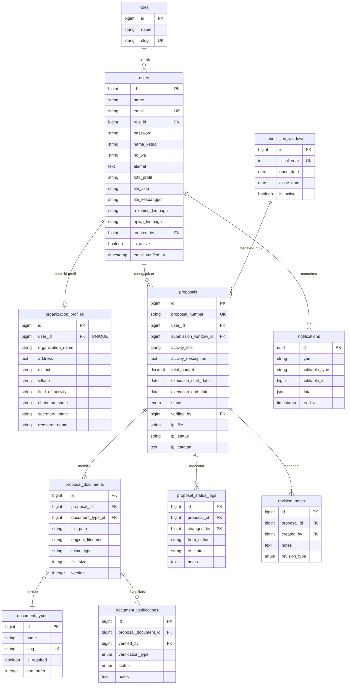
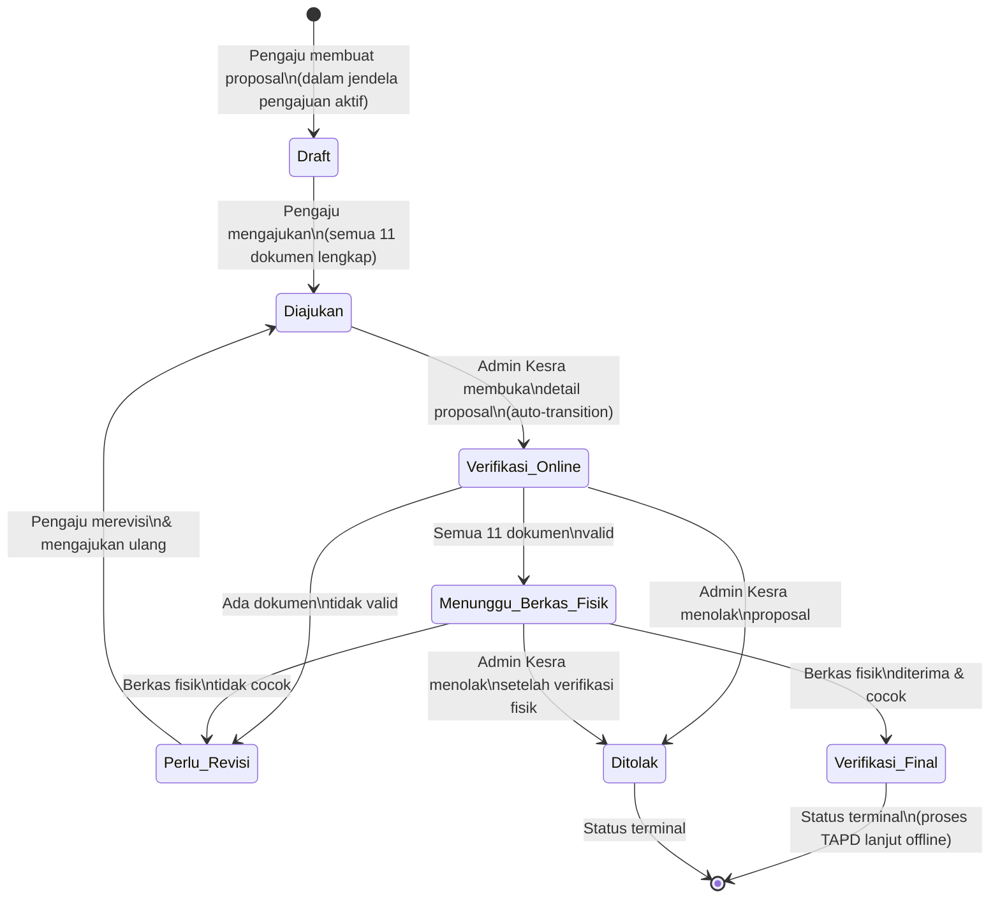
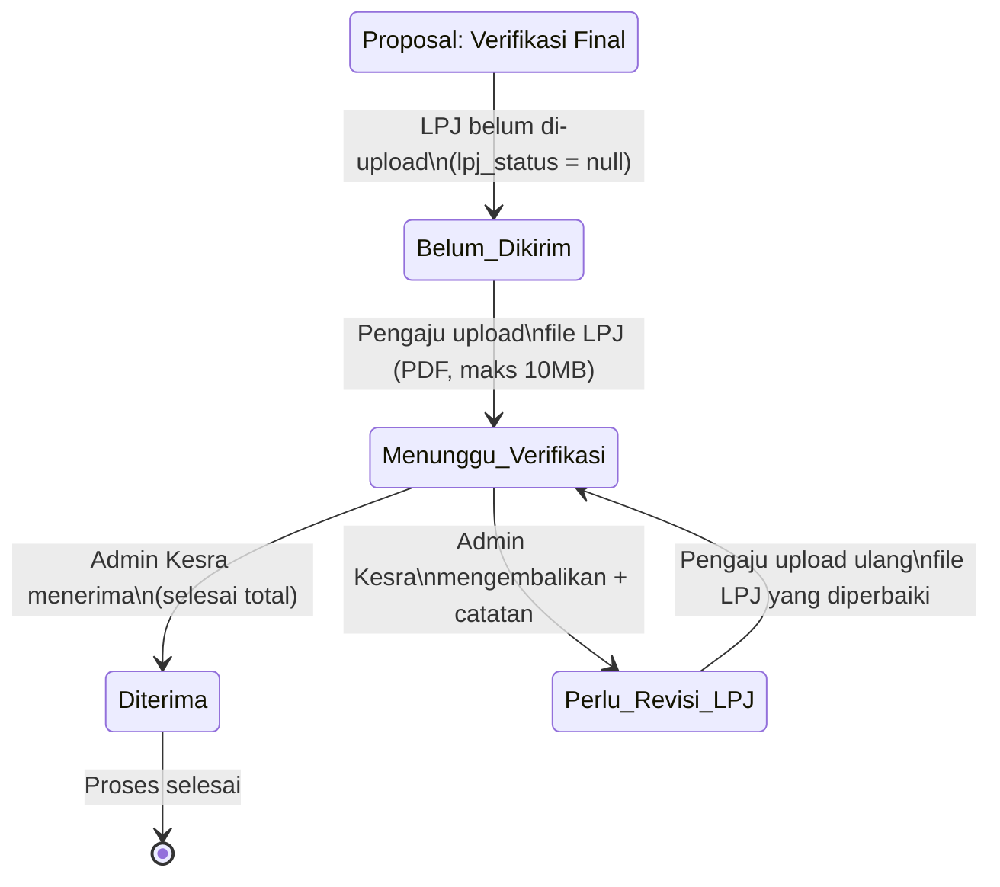

# Product Requirements Document (PRD)
# Portal e-Hibah Kesra — Sistem Informasi Pengelolaan Dana Hibah (Rebuild)

| Informasi Dokumen | Detail |
|---|---|
| **Versi Dokumen** | 1.0 |
| **Tanggal** | 8 September 2026 |
| **Status** | Draft — Menunggu Review Tim |
| **Mata Kuliah** | Manajemen Proyek Sistem Informasi (MPSI) |
| **Metodologi** | Agile (Sprint-based, presentasi progress mingguan) |
| **Tim Pengembang** | Kelompok Mahasiswa (5 orang) |
| **Tech Stack** | Laravel + Inertia.js + Vue.js (VILT Stack), MySQL, Laravel Sanctum |

---

## 1. Executive Summary

### 1.1 Latar Belakang

Pemerintah Kabupaten Pelalawan menerima puluhan hingga ratusan pengajuan dana hibah setiap tahunnya dari berbagai lembaga, yayasan, dan organisasi masyarakat di bawah koordinasi Bagian Kesejahteraan Rakyat (Kesra). Proses pengelolaan dana hibah yang selama ini berjalan secara manual — mulai dari penerimaan berkas, verifikasi kelengkapan, hingga pelaporan pertanggungjawaban — menimbulkan berbagai permasalahan: berkas sering hilang atau tercecer, proses verifikasi tidak transparan, waktu penyelesaian sangat lama, dan tidak ada mekanisme akuntabilitas yang terdokumentasi secara digital.

Pada iterasi sebelumnya, telah dikembangkan sebuah sistem berbasis Laravel 11 (Blade + Tailwind CSS) dengan empat role aktif. Namun, evaluasi menyeluruh terhadap sistem tersebut mengungkap beberapa kelemahan fundamental:

1. **Arsitektur role yang terlalu kompleks** — role Tim Kesra dan Admin Kesra secara operasional menjalankan fungsi yang sama, sehingga pemisahan keduanya tidak efektif.
2. **Celah keamanan penyimpanan file** — berkas legalitas pengaju (NPWP, rekening bank) dan file LPJ disimpan di disk publik yang dapat diakses tanpa autentikasi.
3. **Modul LPJ belum terimplementasi** — sub-alur Laporan Pertanggungjawaban belum masuk dalam lingkup sistem sebelumnya.
4. **Tech stack kurang optimal** — penggunaan Blade memerlukan full-page reload, mengurangi responsivitas antarmuka pengguna.

Project ini merupakan **rebuild total** dari sistem lama, dikerjakan sebagai tugas mata kuliah **Manajemen Proyek Sistem Informasi** oleh kelompok mahasiswa (5 orang) menggunakan metodologi **Agile** dengan presentasi progress mingguan kepada dosen.

### 1.2 Tujuan Produk

Membangun ulang sebuah **sistem informasi berbasis web** menggunakan arsitektur **VILT Stack** (Vue.js + Inertia.js + Laravel + Tailwind CSS) yang mendigitalisasi seluruh alur pengelolaan dana hibah, meliputi:

1. Pendaftaran dan verifikasi identitas pengaju (lembaga/yayasan/organisasi) secara mandiri.
2. Pengunggahan dokumen proposal secara daring dengan manajemen versi.
3. Verifikasi kelengkapan berkas secara online dan offline oleh Admin Kesra.
4. Pengelolaan Laporan Pertanggungjawaban (LPJ) pasca-persetujuan proposal.
5. Penyediaan dashboard analitik dan riwayat pengajuan untuk transparansi dan akuntabilitas.
6. Penyediaan API untuk integrasi aplikasi mobile.

### 1.3 Sasaran Utama

| # | Sasaran | Indikator Keberhasilan |
|---|---|---|
| 1 | Digitalisasi alur pengajuan end-to-end | 100% pengajuan dan LPJ diproses melalui sistem |
| 2 | Transparansi status | Pengaju dapat melacak status proposal secara *real-time* melalui dashboard |
| 3 | Keterlacakan proses | 100% perubahan status proposal tercatat dalam audit trail (`proposal_status_logs`) dan dapat ditelusuri — mencakup informasi siapa yang mengubah, kapan, dari status apa ke status apa, beserta catatan |
| 4 | Kepatuhan jadwal | Sistem secara otomatis membuka/menutup jendela pengajuan sesuai kalender |
| 5 | Akuntabilitas | Setiap perubahan status tercatat sebagai *audit trail* |
| 6 | Keamanan data | Seluruh dokumen sensitif tersimpan di disk privat dengan autentikasi |
| 7 | Interoperabilitas | API mobile tersedia untuk integrasi aplikasi Android |

### 1.4 Ruang Lingkup

- **Dalam lingkup**: Registrasi pengaju, pengajuan proposal, verifikasi online & offline, manajemen LPJ, dashboard & statistik, notifikasi, manajemen akun staf, manajemen jendela pengajuan, audit trail, API mobile.
- **Di luar lingkup**: Lihat **Bagian 7 — Out of Scope**.

---

## 2. Aktor & Matriks Hak Akses

### 2.1 Deskripsi Aktor

Sistem rebuild ini hanya memiliki **3 (tiga) role aktif**. Role "Tim Kesra" dan "TAPD" dari sistem lama telah **dihapus secara permanen**.

| # | Role | Slug di DB | Deskripsi | Cara Registrasi | Jumlah Estimasi |
|---|---|---|---|---|---|
| 1 | **Pengaju** | `pengaju` | Lembaga, yayasan, atau organisasi masyarakat yang mengajukan proposal dana hibah. | Registrasi mandiri via halaman publik + verifikasi email. | Puluhan–ratusan per periode |
| 2 | **Admin Kesra** | `admin-kesra` | Menangani **seluruh** proses verifikasi (online maupun fisik/offline), mengelola LPJ, mengelola jendela pengajuan, melihat dashboard & statistik. Menggabungkan fungsi "Admin Kesra" dan "Tim Kesra" dari sistem lama. | Akun dibuat **manual** oleh Super Admin via panel admin (bukan self-register). | 1–5 orang |
| 3 | **Super Admin** | `super_admin` | Mengelola akun Admin Kesra (CRUD). Memiliki akses tertinggi untuk manajemen pengguna staf. | Akun dibuat via **seeder** saja, tidak lewat UI. | 1 orang |

> [!IMPORTANT]
> **Perubahan Signifikan dari Sistem Lama:**
> - Role **Tim Kesra** (`tim-kesra`) telah **dihapus**. Seluruh tugas verifikasi yang sebelumnya dipegang Tim Kesra kini menjadi tanggung jawab **Admin Kesra**.
> - Role **Tim TAPD** (`tapd`/`tim-tapd`) tetap **tidak ada** dalam sistem. Proses persetujuan anggaran oleh TAPD berlangsung secara offline di luar sistem.

### 2.2 Matriks Hak Akses

| Fitur / Aksi | Pengaju | Admin Kesra | Super Admin |
|---|:---:|:---:|:---:|
| **Autentikasi & Profil** | | | |
| Registrasi mandiri (dengan data institusional) | ✅ | ❌ | ❌ |
| Login | ✅ | ✅ | ✅ |
| Ubah profil sendiri & upload berkas legalitas | ✅ | ✅ | ✅ |
| Ubah password sendiri | ✅ | ✅ | ✅ |
| **Manajemen Proposal** | | | |
| Buat & edit proposal (draft) | ✅ | ❌ | ❌ |
| Upload 11 dokumen wajib | ✅ | ❌ | ❌ |
| Ajukan proposal (draft → diajukan) | ✅ | ❌ | ❌ |
| Revisi & ajukan ulang proposal | ✅ | ❌ | ❌ |
| Lihat status & riwayat proposal sendiri | ✅ | ❌ | ❌ |
| **Verifikasi** | | | |
| Lihat daftar semua pengajuan | ❌ | ✅ | ❌ |
| Verifikasi berkas online (per dokumen) | ❌ | ✅ | ❌ |
| Kirim catatan revisi ke Pengaju | ❌ | ✅ | ❌ |
| Verifikasi & arsip berkas fisik (offline) | ❌ | ✅ | ❌ |
| Tolak proposal | ❌ | ✅ | ❌ |
| **LPJ** | | | |
| Upload file LPJ | ✅ | ❌ | ❌ |
| Verifikasi LPJ (terima / kembalikan) | ❌ | ✅ | ❌ |
| **Monitoring & Informasi** | | | |
| Lihat profil & riwayat pengajuan pengaju | ❌ | ✅ | ❌ |
| Lihat daftar seluruh pengaju terdaftar | ❌ | ✅ | ❌ |
| Lihat dashboard & statistik | ❌ | ✅ | ❌ |
| **Manajemen Jendela Pengajuan** | | | |
| CRUD jendela pengajuan (submission windows) | ❌ | ✅ | ❌ |
| **Manajemen Akun Staf** | | | |
| CRUD akun Admin Kesra | ❌ | ❌ | ✅ |

---

## 3. Functional Requirements (User Stories)

Functional requirements disusun dalam format User Story:
> *"Sebagai [role], saya ingin [aksi], agar [tujuan]."*

Setiap user story diberi kode unik dan prioritas (Tinggi / Sedang / Rendah).

---

### 3.1 Epic: Registrasi & Autentikasi

| ID | User Story | Prioritas |
|---|---|:---:|
| US-AUTH-01 | Sebagai **Pengaju**, saya ingin mendaftarkan akun lembaga saya melalui halaman registrasi publik dengan mengisi: Nama Lembaga, Email, Nama Ketua/Penanggung Jawab, No. WhatsApp, Alamat Lengkap, dan Password, agar saya dapat mengakses sistem untuk mengajukan proposal. | **Tinggi** |
| US-AUTH-02 | Sebagai **Pengaju**, saya ingin menerima email verifikasi setelah registrasi dan mengonfirmasinya, agar akun saya aktif dan terverifikasi. | **Tinggi** |
| US-AUTH-03 | Sebagai **pengguna terdaftar** (semua role), saya ingin login ke sistem menggunakan email dan password, agar saya dapat mengakses fitur sesuai role saya. | **Tinggi** |
| US-AUTH-04 | Sebagai **pengguna terdaftar**, saya ingin mereset password melalui tautan yang dikirim ke email saya, agar saya dapat memulihkan akses jika lupa password. | **Tinggi** |
| US-AUTH-05 | Sebagai **pengguna terdaftar**, saya ingin mengubah password saya melalui halaman profil, agar saya dapat menjaga keamanan akun. | **Sedang** |
| US-AUTH-06 | Sebagai **sistem**, saya ingin mengarahkan pengguna yang mengakses URL root (`/`) ke halaman login secara otomatis, agar tidak ada halaman publik yang tidak terotentikasi. | **Tinggi** |
| US-AUTH-07 | Sebagai **sistem**, saya ingin secara otomatis menetapkan role `pengaju` kepada setiap pengguna yang mendaftar melalui halaman registrasi, agar tidak diperlukan intervensi admin. | **Tinggi** |

---

### 3.2 Epic: Manajemen Profil

| ID | User Story | Prioritas |
|---|---|:---:|
| US-PROF-01 | Sebagai **Pengaju**, saya ingin mengisi dan mengubah profil organisasi saya (nama lembaga, alamat, bidang kegiatan, nama pengurus, kontak), agar data lembaga saya tercatat lengkap di sistem. | **Tinggi** |
| US-PROF-02 | Sebagai **Pengaju**, saya ingin mengunggah berkas legalitas organisasi (foto profil, akta pendirian, SK Kesbangpol, fotokopi rekening bank, NPWP lembaga), agar Admin Kesra dapat memverifikasi legalitas lembaga saya. | **Tinggi** |
| US-PROF-03 | Sebagai **Admin Kesra**, saya ingin mengubah informasi profil dasar saya (nama, email, no. telepon), agar data saya tetap akurat. | **Sedang** |

---

### 3.3 Epic: Manajemen Proposal

| ID | User Story | Prioritas |
|---|---|:---:|
| US-PROP-01 | Sebagai **Pengaju**, saya ingin membuat proposal baru dengan mengisi judul kegiatan, deskripsi kegiatan, total anggaran, dan periode pelaksanaan, agar pengajuan dana hibah saya tercatat di sistem. | **Tinggi** |
| US-PROP-02 | Sebagai **Pengaju**, saya ingin menyimpan proposal sebagai **Draft** dan melanjutkan pengisian di lain waktu, agar saya tidak kehilangan progress pengisian. | **Tinggi** |
| US-PROP-03 | Sebagai **Pengaju**, saya ingin mengunggah 11 dokumen wajib (PDF/JPG/PNG, maks 5 MB per file) ke proposal saya, agar persyaratan administratif terpenuhi. | **Tinggi** |
| US-PROP-04 | Sebagai **Pengaju**, saya ingin melihat checklist visual (✅/❌) yang menunjukkan kelengkapan dokumen saya, agar saya tahu dokumen mana yang belum diunggah. | **Tinggi** |
| US-PROP-05 | Sebagai **Pengaju**, saya ingin mengajukan proposal (mengubah status dari Draft ke Diajukan) hanya jika **seluruh 11 dokumen sudah diunggah**, agar tidak ada pengajuan dengan berkas tidak lengkap. | **Tinggi** |
| US-PROP-06 | Sebagai **Pengaju**, saya **tidak dapat** mengedit proposal yang sudah diajukan, kecuali statusnya dikembalikan ke Perlu Revisi oleh Admin Kesra, agar integritas data pengajuan terjaga. | **Tinggi** |
| US-PROP-07 | Sebagai **Pengaju**, saya ingin melihat status proposal aktif saya melalui **visual stepper** di dashboard, agar saya dapat memantau progres pengajuan secara intuitif. | **Sedang** |
| US-PROP-08 | Sebagai **Pengaju**, saya ingin melihat riwayat pengajuan tahun-tahun sebelumnya dalam mode *read-only*, agar saya punya referensi historis. | **Rendah** |
| US-PROP-09 | Sebagai **sistem**, saya ingin membatasi pembuatan proposal baru **hanya pada periode jendela pengajuan yang aktif** untuk tahun anggaran berjalan, agar kepatuhan jadwal terjaga. Di luar periode tersebut, fitur pembuatan proposal dinonaktifkan. | **Tinggi** |
| US-PROP-10 | Sebagai **sistem**, saya ingin membatasi setiap Pengaju agar hanya memiliki **maksimal 1 proposal aktif per tahun anggaran**, agar tidak terjadi pengajuan ganda. | **Tinggi** |
| US-PROP-11 | Sebagai **sistem**, saya ingin menghasilkan nomor proposal dengan format `HIBAH-{TAHUN_ANGGARAN}-{UNIX_TIMESTAMP}` secara otomatis saat proposal dibuat, agar penomoran unik dan konsisten. | **Tinggi** |

---

### 3.4 Epic: Verifikasi Proposal

| ID | User Story | Prioritas |
|---|---|:---:|
| US-VER-01 | Sebagai **Admin Kesra**, saya ingin melihat daftar proposal berstatus **Diajukan** yang perlu diverifikasi, agar saya tahu proposal mana yang menunggu tindakan. | **Tinggi** |
| US-VER-02 | Sebagai **Admin Kesra**, saat saya membuka detail proposal berstatus **Diajukan**, saya ingin status otomatis berubah ke **Verifikasi Online**, agar tercatat bahwa proses verifikasi telah dimulai. | **Tinggi** |
| US-VER-03 | Sebagai **Admin Kesra**, saya ingin memverifikasi setiap dokumen secara individual dengan memberikan status **Valid** atau **Tidak Valid** beserta catatan, agar evaluasi bersifat per-dokumen dan terdokumentasi. | **Tinggi** |
| US-VER-04 | Sebagai **Admin Kesra**, jika semua 11 dokumen valid, saya ingin memajukan status proposal ke **Menunggu Berkas Fisik**, agar Pengaju mengetahui bahwa tahap verifikasi online telah selesai dan perlu menyerahkan berkas fisik. | **Tinggi** |
| US-VER-05 | Sebagai **Admin Kesra**, jika ada dokumen yang tidak valid, saya ingin mengembalikan status proposal ke **Perlu Revisi** disertai catatan revisi, agar Pengaju dapat memperbaiki dokumen yang bermasalah. | **Tinggi** |
| US-VER-06 | Sebagai **Admin Kesra**, saya ingin menolak proposal disertai alasan penolakan, agar proposal yang tidak memenuhi syarat dapat dihentikan prosesnya. | **Tinggi** |
| US-VER-07 | Sebagai **Pengaju**, saat proposal berstatus **Perlu Revisi**, saya ingin hanya mengunggah ulang dokumen yang ditandai **Tidak Valid** (tanpa harus mengunggah ulang dokumen yang sudah Valid), agar proses revisi efisien. | **Tinggi** |
| US-VER-08 | Sebagai **Pengaju**, setelah merevisi dokumen, saya ingin mengajukan ulang proposal (status kembali ke **Diajukan**), agar proposal masuk kembali ke antrian verifikasi. | **Tinggi** |
| US-VER-09 | Sebagai **Admin Kesra**, saya ingin membuka halaman **Arsip Berkas Fisik** yang menampilkan proposal berstatus `menunggu_berkas_fisik` dan `verifikasi_final` dengan fitur pencarian, agar saya dapat mencocokkan berkas fisik dengan berkas online. | **Tinggi** |
| US-VER-10 | Sebagai **Admin Kesra**, jika berkas fisik cocok, saya ingin memajukan status proposal ke **Verifikasi Final**, agar proses verifikasi selesai dan tercatat di sistem. | **Tinggi** |
| US-VER-11 | Sebagai **Admin Kesra**, jika berkas fisik tidak cocok, saya ingin mengembalikan proposal ke **Perlu Revisi** atau menolaknya, agar ada tindak lanjut yang jelas. | **Tinggi** |
| US-VER-12 | Sebagai **Admin Kesra**, saya ingin membuka profil pengaju yang menampilkan data lembaga, berkas legalitas, dan **tabel riwayat pengajuan proposal** (seluruh proposal pengaju tersebut, diurutkan terbaru), agar saya dapat melakukan evaluasi kontekstual terhadap pengaju. | **Tinggi** |
| US-VER-13 | Sebagai **Admin Kesra**, saya ingin melihat daftar seluruh pengaju terdaftar dengan fitur pencarian, agar saya dapat mengakses profil pengaju dengan cepat. | **Sedang** |

---

### 3.5 Epic: Laporan Pertanggungjawaban (LPJ)

| ID | User Story | Prioritas |
|---|---|:---:|
| US-LPJ-01 | Sebagai **Pengaju**, setelah proposal saya berstatus **Verifikasi Final**, saya ingin mengunggah file LPJ (PDF, maks 10 MB), agar saya dapat memenuhi kewajiban pelaporan penggunaan dana hibah. | **Tinggi** |
| US-LPJ-02 | Sebagai **Pengaju**, saya ingin melihat status LPJ saya (Menunggu Verifikasi / Perlu Revisi / Diterima) di dashboard, agar saya mengetahui progres pelaporan. | **Tinggi** |
| US-LPJ-03 | Sebagai **Pengaju**, jika LPJ saya dikembalikan untuk revisi, saya ingin melihat catatan revisi dari Admin Kesra dan mengunggah ulang file LPJ yang telah diperbaiki, agar siklus revisi berjalan efisien. | **Tinggi** |
| US-LPJ-04 | Sebagai **Admin Kesra**, saya ingin melihat daftar LPJ yang menunggu verifikasi, agar saya tahu LPJ mana yang perlu ditindaklanjuti. | **Tinggi** |
| US-LPJ-05 | Sebagai **Admin Kesra**, saya ingin menerima atau mengembalikan LPJ disertai catatan, agar pelaporan pertanggungjawaban terverifikasi. | **Tinggi** |
| US-LPJ-06 | Sebagai **sistem**, saya ingin mendukung siklus revisi LPJ yang tidak terbatas (upload → verifikasi → revisi → upload ulang → …), agar proses perbaikan dapat berulang hingga LPJ memenuhi standar. | **Sedang** |

---

### 3.6 Epic: Dashboard & Notifikasi

| ID | User Story | Prioritas |
|---|---|:---:|
| US-DASH-01 | Sebagai **Pengaju**, saya ingin melihat dashboard yang menampilkan: status proposal aktif (dengan visual stepper), status LPJ (jika ada), riwayat pengajuan tahun sebelumnya, dan alert kontekstual, agar saya mendapatkan gambaran lengkap pengajuan saya. | **Tinggi** |
| US-DASH-02 | Sebagai **Admin Kesra**, saya ingin melihat dashboard yang menampilkan: 4 kartu statistik (Total Diajukan, Verifikasi Online, Menunggu Berkas Fisik, Disetujui Final), tabel pengajuan terbaru, dan ringkasan LPJ yang menunggu verifikasi, agar saya dapat memantau beban kerja dan status keseluruhan. | **Tinggi** |
| US-NOTIF-01 | Sebagai **Admin Kesra**, saya ingin menerima notifikasi *in-app* saat ada proposal baru diajukan, agar saya segera mengetahui pengajuan yang masuk. | **Tinggi** |
| US-NOTIF-02 | Sebagai **Pengaju**, saya ingin menerima notifikasi *in-app* saat LPJ saya diverifikasi (diterima) atau dikembalikan untuk revisi, agar saya segera mengetahui hasil verifikasi. | **Tinggi** |
| US-NOTIF-03 | Sebagai **Pengaju**, saya ingin menerima alert khusus di dashboard saat proposal berstatus **Perlu Revisi** (banner peringatan) atau **Verifikasi Final** (banner sukses), agar informasi penting langsung terlihat. | **Sedang** |

---

### 3.7 Epic: Manajemen Akun Staf

| ID | User Story | Prioritas |
|---|---|:---:|
| US-STAFF-01 | Sebagai **Super Admin**, saya ingin membuat akun Admin Kesra baru dari panel admin dengan mengisi nama, email, dan password, agar staf Kesra dapat mengakses sistem. | **Tinggi** |
| US-STAFF-02 | Sebagai **Super Admin**, saya ingin melihat daftar seluruh akun Admin Kesra yang terdaftar, agar saya dapat memantau pengguna staf. | **Tinggi** |
| US-STAFF-03 | Sebagai **Super Admin**, saya ingin mengedit informasi akun Admin Kesra (nama, email), agar data staf tetap akurat. | **Sedang** |
| US-STAFF-04 | Sebagai **Super Admin**, saya ingin menonaktifkan atau mengaktifkan kembali akun Admin Kesra, agar akses staf dapat dikelola tanpa menghapus data. | **Sedang** |

---

### 3.8 Epic: Manajemen Jendela Pengajuan

| ID | User Story | Prioritas |
|---|---|:---:|
| US-SW-01 | Sebagai **Admin Kesra**, saya ingin membuat entri jendela pengajuan baru untuk tahun anggaran tertentu dengan menentukan tanggal buka dan tanggal tutup, agar sistem mengetahui kapan periode pengajuan dimulai dan berakhir untuk tahun tersebut. | **Tinggi** |
| US-SW-02 | Sebagai **Admin Kesra**, saya ingin mengubah tanggal buka dan/atau tanggal tutup jendela pengajuan yang sudah ada, agar jadwal pengajuan dapat disesuaikan jika ada perubahan kebijakan. | **Sedang** |
| US-SW-03 | Sebagai **Admin Kesra**, saya ingin mengaktifkan atau menonaktifkan jendela pengajuan tertentu, agar saya dapat mengontrol periode mana yang sedang berlaku tanpa menghapus data jendela. | **Sedang** |

---

### 3.9 Epic: API Mobile

| ID | User Story | Prioritas |
|---|---|:---:|
| US-API-01 | Sebagai **pengembang aplikasi mobile**, saya ingin endpoint `POST /api/login` yang menerima email & password dan mengembalikan token Sanctum, agar pengguna mobile dapat terautentikasi. | **Tinggi** |
| US-API-02 | Sebagai **pengembang aplikasi mobile**, saya ingin endpoint `GET /api/proposals` (publik, tanpa auth) yang mengembalikan daftar proposal berstatus `verifikasi_final`, agar data hibah yang sudah disetujui dapat ditampilkan di aplikasi mobile. | **Tinggi** |
| US-API-03 | Sebagai **pengembang aplikasi mobile**, saya ingin endpoint `GET /api/user` (dengan Bearer Token Sanctum) yang mengembalikan data pengguna yang sedang login, agar aplikasi mobile dapat menampilkan informasi pengguna. | **Tinggi** |

---

## 4. Non-Functional Requirements

### 4.1 Keamanan

| ID | Requirement | Prioritas |
|---|---|:---:|
| NFR-SEC-01 | **Seluruh dokumen sensitif** — dokumen proposal, berkas legalitas pengaju (NPWP, rekening bank, akta, SK Kesbangpol), dan file LPJ — wajib disimpan di **disk privat** (`local` / non-public). Akses file hanya melalui controller yang menerapkan autentikasi dan otorisasi (policy check). | **Tinggi** |
| NFR-SEC-02 | Sistem menggunakan **HTTPS** untuk semua komunikasi (di-enforce di level web server). | **Tinggi** |
| NFR-SEC-03 | Password di-hash menggunakan **bcrypt** (default Laravel). | **Tinggi** |
| NFR-SEC-04 | Sistem menerapkan **rate limiting** pada endpoint login dan registrasi untuk mencegah brute force. | **Sedang** |
| NFR-SEC-05 | Autentikasi API mobile menggunakan **Laravel Sanctum** (token-based). Token diberi nama identifikasi (e.g., `MobileAppToken`). | **Tinggi** |
| NFR-SEC-06 | Setiap perubahan status proposal wajib dicatat sebagai **audit trail** di tabel `proposal_status_logs` (siapa, kapan, dari status apa ke status apa, catatan). | **Tinggi** |
| NFR-SEC-07 | **Retensi file versi lama**: Seluruh versi dokumen proposal yang pernah diunggah wajib **disimpan secara permanen** di disk privat. File versi lama tidak boleh dihapus saat Pengaju mengunggah revisi, agar Admin Kesra dapat mengakses riwayat dokumen untuk keperluan audit dan perbandingan. | **Tinggi** |

> [!CAUTION]
> **Perbaikan Kritis dari Sistem Lama:**
> Pada sistem lama, berkas legalitas pengaju dan file LPJ disimpan di disk `public` yang dapat diakses langsung via URL tanpa autentikasi. Ini merupakan **bug keamanan** yang **wajib diperbaiki** pada rebuild ini. Semua file sensitif harus dipindahkan ke disk privat.

### 4.2 Performa

| ID | Requirement | Prioritas |
|---|---|:---:|
| NFR-PERF-01 | Waktu respons halaman ≤ 2 detik pada kondisi normal (koneksi broadband standar). | **Sedang** |
| NFR-PERF-02 | Sistem harus mampu menangani minimal 100 pengguna konkuren tanpa degradasi signifikan. | **Rendah** |

### 4.3 Usability

| ID | Requirement | Prioritas |
|---|---|:---:|
| NFR-UX-01 | Seluruh antarmuka dibangun sebagai **Single Page Application (SPA)** menggunakan Inertia.js + Vue.js, menghilangkan full-page reload dan memberikan pengalaman pengguna yang responsif. | **Tinggi** |
| NFR-UX-02 | Antarmuka mendukung **responsivitas** untuk perangkat desktop dan tablet. | **Sedang** |
| NFR-UX-03 | Status proposal ditampilkan dengan **badge berwarna** yang konsisten di seluruh aplikasi untuk memudahkan identifikasi visual. | **Sedang** |
| NFR-UX-04 | Formulir menggunakan **validasi real-time** di sisi client (Vue.js) dan validasi di sisi server (Laravel Form Request). | **Sedang** |

### 4.4 Maintainability

| ID | Requirement | Prioritas |
|---|---|:---:|
| NFR-MAINT-01 | Status proposal di-enforce secara ketat melalui **PHP Backed Enum** (`App\Enums\ProposalStatus`) di level aplikasi. | **Tinggi** |
| NFR-MAINT-02 | Otorisasi akses menggunakan **Laravel Middleware** (`CheckRole`) dan **Laravel Policy** untuk granular control. | **Tinggi** |
| NFR-MAINT-03 | Tabel `roles` hanya berisi **3 baris** (`pengaju`, `admin-kesra`, `super_admin`). Tidak boleh ada slug duplikat atau legacy. | **Tinggi** |

---

## 5. Data Model

### 5.1 Entitas Utama & Relasi

Berikut adalah daftar entitas/tabel utama beserta kolom-kolom penting dan relasinya. Ini bukan skema database lengkap, melainkan ringkasan untuk acuan pengembangan.



---

### 5.2 Daftar Tabel & Kolom Penting

#### Tabel `roles`

Menyimpan daftar role pengguna. **Hanya 3 baris** pada sistem rebuild.

| Kolom | Tipe | Keterangan |
|---|---|---|
| `id` | BIGINT, PK | Auto increment |
| `name` | VARCHAR(255) | Nama display: "Pengaju", "Admin Kesra", "Super Admin" |
| `slug` | VARCHAR(255), UNIQUE | Identifier: `pengaju`, `admin-kesra`, `super_admin` |

**Seed Data:**

| id | name | slug |
|---|---|---|
| 1 | Pengaju | `pengaju` |
| 2 | Admin Kesra | `admin-kesra` |
| 3 | Super Admin | `super_admin` |

---

#### Tabel `users`

Menyimpan data akun semua pengguna. Field legalitas dan institusional khusus untuk role Pengaju.

| Kolom | Tipe | Keterangan |
|---|---|---|
| `id` | BIGINT, PK | |
| `name` | VARCHAR(255) | Nama lembaga (Pengaju) atau nama pribadi (staf) |
| `email` | VARCHAR(255), UNIQUE | |
| `password` | VARCHAR(255) | Hash bcrypt |
| `role_id` | BIGINT, FK → `roles.id` | |
| `created_by` | BIGINT, FK → `users.id`, NULLABLE | NULL = self-registered; berisi ID Super Admin jika akun dibuat oleh Super Admin |
| `is_active` | BOOLEAN, DEFAULT TRUE | |
| `nama_ketua` | VARCHAR(255), NULLABLE | Nama Ketua/Penanggung Jawab — dari registrasi Pengaju |
| `no_wa` | VARCHAR(255), NULLABLE | No. WhatsApp — dari registrasi Pengaju |
| `alamat` | TEXT, NULLABLE | Alamat lengkap — dari registrasi Pengaju |
| `foto_profil` | VARCHAR(255), NULLABLE | Path file di **disk privat** |
| `file_akta` | VARCHAR(255), NULLABLE | Path file akta pendirian di **disk privat** |
| `file_kesbangpol` | VARCHAR(255), NULLABLE | Path file SK Kesbangpol di **disk privat** |
| `rekening_lembaga` | VARCHAR(255), NULLABLE | Path file rekening bank di **disk privat** |
| `npwp_lembaga` | VARCHAR(255), NULLABLE | Path file NPWP di **disk privat** |
| `email_verified_at` | TIMESTAMP, NULLABLE | |

---

#### Tabel `proposals`

Tabel inti — data proposal pengajuan dana hibah dan informasi LPJ.

| Kolom | Tipe | Keterangan |
|---|---|---|
| `id` | BIGINT, PK | |
| `proposal_number` | VARCHAR(255), UNIQUE | Format: `HIBAH-{TAHUN}-{UNIX_TIMESTAMP}` |
| `user_id` | BIGINT, FK → `users.id` | Pengaju pemilik |
| `submission_window_id` | BIGINT, FK → `submission_windows.id` | Tahun anggaran |
| `activity_title` | VARCHAR(255) | Judul kegiatan |
| `activity_description` | TEXT, NULLABLE | |
| `total_budget` | DECIMAL(15,2) | Total anggaran yang diajukan |
| `execution_start_date` | DATE, NULLABLE | |
| `execution_end_date` | DATE, NULLABLE | |
| `status` | ENUM (7 nilai) | Status proposal (lihat Bagian 6) |
| `verified_by` | BIGINT, FK → `users.id`, NULLABLE | Admin Kesra yang memverifikasi |
| `submitted_at` | TIMESTAMP, NULLABLE | Waktu pertama kali diajukan |
| `verified_online_at` | TIMESTAMP, NULLABLE | |
| `physical_docs_received_at` | TIMESTAMP, NULLABLE | |
| `final_verified_at` | TIMESTAMP, NULLABLE | |
| `rejected_at` | TIMESTAMP, NULLABLE | |
| `lpj_file` | VARCHAR(255), NULLABLE | Path file LPJ di **disk privat** |
| `lpj_status` | VARCHAR(255), NULLABLE | Enum informal: `null`, `menunggu`, `revisi`, `diterima` |
| `lpj_catatan` | TEXT, NULLABLE | Catatan revisi LPJ dari Admin Kesra |

---

#### Tabel `document_types`

Master data 11 jenis dokumen wajib. Di-seed saat inisialisasi.

| # | Nama Dokumen | Slug |
|:---:|---|---|
| 1 | Surat Permohonan Bantuan Hibah (TTD Ketua & Sekretaris) | `surat-permohonan` |
| 2 | Fotokopi Bukti Legalitas / SK | `bukti-legalitas` |
| 3 | Akta Menkumham / Akta Pendiri / Bukti Legalitas | `akta-pendirian` |
| 4 | Fotokopi Rekening Bank | `rekening-bank` |
| 5 | Fotokopi KTP (Ketua, Sekretaris, Bendahara) | `fotokopi-ktp` |
| 6 | RAB (TTD Ketua & Bendahara) | `rab` |
| 7 | Fotokopi NPWP | `npwp` |
| 8 | Surat Pernyataan Tanggung Jawab Permohonan (Bermaterai 10.000) | `sptjp` |
| 9 | Surat Pernyataan Tanggung Jawab Penggunaan (Bermaterai 10.000) | `sptj-penggunaan` |
| 10 | Pakta Integritas | `pakta-integritas` |
| 11 | Surat Keterangan Domisili Lembaga (Diketahui Desa/Kelurahan) | `sk-domisili` |

---

#### Tabel `proposal_documents`

File dokumen yang diunggah Pengaju, mendukung **versioning** saat revisi. **Semua versi disimpan permanen** — file versi lama tidak dihapus saat ada revisi, agar Admin Kesra dapat mengakses riwayat dokumen untuk keperluan audit dan perbandingan.

| Kolom | Tipe | Keterangan |
|---|---|---|
| `id` | BIGINT, PK | |
| `proposal_id` | BIGINT, FK → `proposals.id` | |
| `document_type_id` | BIGINT, FK → `document_types.id` | |
| `file_path` | VARCHAR(255) | Path di **disk privat** |
| `original_filename` | VARCHAR(255) | Nama file asli saat upload |
| `mime_type` | VARCHAR(50) | `application/pdf`, `image/jpeg`, `image/png` |
| `file_size` | UNSIGNED INT | Ukuran dalam bytes |
| `version` | UNSIGNED SMALLINT, DEFAULT 1 | Increment saat revisi; versi terbesar = dokumen aktif |

**Unique Constraint:** `(proposal_id, document_type_id, version)`

> [!NOTE]
> Saat Pengaju mengunggah ulang dokumen yang direvisi, sistem membuat **record baru** di tabel `proposal_documents` dengan `version + 1`. Record dan file versi sebelumnya **tetap tersimpan**. Untuk menampilkan dokumen terkini, query mengambil record dengan `version` tertinggi per `(proposal_id, document_type_id)`.

---

#### Tabel `document_verifications`

Hasil verifikasi per dokumen oleh Admin Kesra (online dan offline).

| Kolom | Tipe | Keterangan |
|---|---|---|
| `proposal_document_id` | BIGINT, FK → `proposal_documents.id` | |
| `verified_by` | BIGINT, FK → `users.id` | Admin Kesra yang memeriksa |
| `verification_type` | ENUM(`online`, `offline`) | Tahap verifikasi |
| `status` | ENUM(`valid`, `tidak_valid`) | Hasil verifikasi |
| `notes` | TEXT, NULLABLE | Catatan verifikator |

---

#### Tabel `revision_notes`

Catatan revisi keseluruhan yang dikirim Admin Kesra ke Pengaju.

| Kolom | Tipe | Keterangan |
|---|---|---|
| `proposal_id` | BIGINT, FK → `proposals.id` | |
| `created_by` | BIGINT, FK → `users.id` | Admin Kesra yang menulis |
| `notes` | TEXT | Isi catatan revisi |
| `revision_type` | ENUM(`online`, `offline`) | Konteks revisi |

---

#### Tabel `proposal_status_logs`

Audit trail setiap perubahan status proposal.

| Kolom | Tipe | Keterangan |
|---|---|---|
| `proposal_id` | BIGINT, FK → `proposals.id` | |
| `changed_by` | BIGINT, FK → `users.id`, NULLABLE | Siapa yang mengubah status |
| `from_status` | VARCHAR(255), NULLABLE | Status sebelumnya (null saat baru dibuat) |
| `to_status` | VARCHAR(255) | Status baru |
| `notes` | TEXT, NULLABLE | Keterangan perubahan |

---

#### Tabel `notifications`

Menggunakan skema bawaan Laravel Database Notifications (polymorphic).

| Kolom | Tipe | Keterangan |
|---|---|---|
| `id` | UUID, PK | |
| `type` | VARCHAR(255) | Class notification |
| `notifiable_type` | VARCHAR(255) | Polymorphic type (`App\Models\User`) |
| `notifiable_id` | BIGINT UNSIGNED | ID user penerima |
| `data` | JSON | Payload: `{ title, message, url }` |
| `read_at` | TIMESTAMP, NULLABLE | Null = belum dibaca |

---

#### Tabel `personal_access_tokens`

Skema bawaan Laravel Sanctum untuk autentikasi API mobile.

---

### 5.3 Ringkasan Relasi

| Relasi | Tipe | Deskripsi |
|---|---|---|
| `users` → `roles` | Many-to-One | Setiap user memiliki 1 role |
| `users` → `organization_profiles` | One-to-One | Setiap Pengaju memiliki 1 profil organisasi |
| `users` → `proposals` (via `user_id`) | One-to-Many | Pengaju memiliki banyak proposal |
| `users` → `proposals` (via `verified_by`) | One-to-Many | Admin Kesra memverifikasi banyak proposal |
| `users` → `users` (via `created_by`) | One-to-Many (self) | Super Admin membuat akun Admin Kesra |
| `proposals` → `submission_windows` | Many-to-One | Proposal terikat jendela tahun |
| `proposals` → `proposal_documents` | One-to-Many | Proposal memiliki banyak dokumen (termasuk semua versi) |
| `proposals` → `proposal_status_logs` | One-to-Many | Proposal memiliki banyak log status |
| `proposals` → `revision_notes` | One-to-Many | Proposal memiliki banyak catatan revisi |
| `proposal_documents` → `document_types` | Many-to-One | Setiap dokumen bertipe 1 dari 11 jenis |
| `proposal_documents` → `document_verifications` | One-to-Many | Setiap dokumen memiliki riwayat verifikasi |
| `users` → `notifications` | One-to-Many (polymorphic) | User menerima banyak notifikasi |

### 5.4 Aturan Penyimpanan File

> [!IMPORTANT]
> **SEMUA file sensitif wajib disimpan di disk privat.** Ini adalah perbaikan keamanan kritis dari sistem lama.
> **SEMUA versi file dokumen proposal disimpan secara permanen.** File versi lama tidak dihapus saat ada revisi.

| Jenis File | Disk | Lokasi Storage | Akses | Retensi |
|---|---|---|---|---|
| Dokumen proposal (11 jenis) | `local` (private) | `storage/app/private/proposals/{tahun}/{user_id}/` | Hanya via controller + auth + policy check | **Permanen** — semua versi disimpan |
| Berkas legalitas pengaju (akta, SK, rekening, NPWP) | `local` (private) | `storage/app/private/profiles/{user_id}/` | Hanya via controller + auth + policy check | Permanen |
| Foto profil pengaju | `local` (private) | `storage/app/private/profiles/{user_id}/` | Hanya via controller + auth check | Permanen |
| File LPJ | `local` (private) | `storage/app/private/lpj/{proposal_id}/` | Hanya via controller + auth + policy check | Permanen |

---

## 6. Alur Proses / Workflow Diagram

### 6.1 State Machine Proposal (7 Status)



### 6.2 Daftar Status (Enum)

| # | Nilai Enum | Label UI | Sifat |
|:---:|---|---|---|
| 1 | `draft` | Draft | Editable |
| 2 | `diajukan` | Diajukan | Locked |
| 3 | `verifikasi_online` | Verifikasi Berkas Online | Locked |
| 4 | `perlu_revisi` | Perlu Revisi | Editable (hanya dokumen tidak valid) |
| 5 | `menunggu_berkas_fisik` | Menunggu Berkas Fisik | Locked |
| 6 | `verifikasi_final` | Verifikasi Final / Selesai | **Terminal** |
| 7 | `ditolak` | Ditolak | **Terminal** |

### 6.3 Tabel Transisi Status

| # | Dari Status | Ke Status | Aktor | Kondisi / Trigger |
|---|---|---|---|---|
| 1 | *(baru)* | **Draft** | Pengaju | Pengaju membuat proposal baru (harus dalam jendela pengajuan) |
| 2 | **Draft** | **Diajukan** | Pengaju | Semua 11 dokumen sudah diunggah |
| 3 | **Diajukan** | **Verifikasi Online** | Admin Kesra | Otomatis saat Admin Kesra membuka halaman detail proposal |
| 4 | **Verifikasi Online** | **Perlu Revisi** | Admin Kesra | ≥ 1 dokumen berstatus "Tidak Valid", disertai catatan revisi |
| 5 | **Verifikasi Online** | **Menunggu Berkas Fisik** | Admin Kesra | Semua 11 dokumen berstatus "Valid" |
| 6 | **Verifikasi Online** | **Ditolak** | Admin Kesra | Proposal tidak memenuhi syarat, ditolak dengan alasan |
| 7 | **Perlu Revisi** | **Diajukan** | Pengaju | Pengaju memperbaiki & mengunggah ulang dokumen, lalu mengajukan ulang |
| 8 | **Menunggu Berkas Fisik** | **Verifikasi Final** | Admin Kesra | Berkas fisik diterima & dicocokkan |
| 9 | **Menunggu Berkas Fisik** | **Perlu Revisi** | Admin Kesra | Berkas fisik tidak cocok / ada kekurangan |
| 10 | **Menunggu Berkas Fisik** | **Ditolak** | Admin Kesra | Proposal ditolak setelah verifikasi fisik gagal |

### 6.4 Aturan State Machine

> [!IMPORTANT]
> **Aturan Kritis:**
> 1. Transisi status **hanya boleh terjadi sesuai tabel di atas**. Tidak ada transisi lain yang diizinkan.
> 2. Status **Verifikasi Final** dan **Ditolak** bersifat **terminal** — tidak ada transisi lanjutan dalam sistem.
> 3. Setiap transisi status **wajib** dicatat di tabel `proposal_status_logs` untuk audit trail.
> 4. Siklus revisi (`perlu_revisi` ↔ `diajukan`) **tidak terbatas** jumlahnya, baik dari tahap verifikasi online maupun verifikasi fisik.
> 5. Enum proposal status di-enforce secara ketat di level aplikasi melalui PHP Backed Enum.

### 6.5 Sub-Alur LPJ (Laporan Pertanggungjawaban)

LPJ adalah tahap **pasca-`verifikasi_final`**. Alurnya melekat pada proposal yang sudah selesai.



**4 Status LPJ:**

| Nilai | Label UI | Keterangan |
|---|---|---|
| `null` | Belum Dikirim | LPJ belum di-upload |
| `menunggu` | Menunggu Verifikasi | LPJ sudah di-upload, menunggu Admin Kesra |
| `revisi` | Perlu Revisi | Dikembalikan dengan catatan |
| `diterima` | Diterima / Selesai | LPJ disetujui — akhir dari seluruh proses |

---

## 7. Out of Scope

Hal-hal berikut **secara eksplisit tidak termasuk** dalam lingkup project rebuild ini:

| # | Item | Keterangan |
|---|---|---|
| 1 | **Modul persetujuan TAPD** | Proses persetujuan anggaran oleh TAPD berlangsung secara offline di luar sistem. |
| 2 | **Pencairan keuangan / integrasi bank** | Sistem tidak menangani transfer dana atau integrasi dengan sistem perbankan. |
| 3 | **Audit eksternal** | Tidak ada modul audit oleh pihak ketiga (BPK, inspektorat). |
| 4 | **Notifikasi email / WhatsApp** | Notifikasi hanya bersifat *in-app* (database notification). Integrasi email/WhatsApp untuk notifikasi dapat dikembangkan di fase berikutnya. |
| 5 | **Ekspor laporan (Excel/CSV)** | Fitur ekspor data ke Excel/CSV tidak termasuk dalam scope MVP, namun dapat ditambahkan kemudian. |
| 6 | **Multi-bahasa (i18n)** | Sistem hanya mendukung bahasa Indonesia. |
| 7 | **Role escalation / approval chain** | Tidak ada alur persetujuan berjenjang di dalam sistem. Admin Kesra memiliki wewenang penuh untuk verifikasi. |
| 8 | **Upload batch / bulk operation** | Dokumen diunggah satu per satu per jenis. Tidak ada fitur upload massal. |
| 9 | **Modul anggaran / RAB detail** | Sistem hanya mencatat `total_budget` sebagai angka. Tidak ada breakdown RAB item-by-item di dalam sistem. |
| 10 | **Aplikasi mobile** | Yang disediakan hanya API endpoint (Sanctum). Pengembangan aplikasi mobile bukan bagian dari project ini. |

---

## 8. Open Questions & Asumsi

### 8.1 Open Questions

| # | Pertanyaan | Status | Dampak |
|---|---|---|---|
| 1 | Berapa jumlah sprint dan durasi per sprint yang disetujui dosen? | **TBD — menunggu konfirmasi dosen** | Menentukan pembagian user story ke sprint backlog |
| 2 | Apakah deployment dilakukan di server kampus atau cloud hosting (VPS)? | **TBD** | Menentukan konfigurasi environment dan CI/CD |
| 3 | Apakah perlu fitur "nominal disetujui" (`nominal_disetujui`) pada proposal? Di sistem lama field ini ada tapi tidak jelas siapa yang mengisi. | **TBD — perlu diskusi tim** | Menentukan apakah field ini dipertahankan, dihapus, atau diisi oleh Admin Kesra |
| 4 | Apakah verifikasi email menggunakan SMTP kampus atau layanan pihak ketiga (Mailtrap, Mailgun)? | **TBD** | Konfigurasi mail driver Laravel |
| 5 | Apakah diperlukan seeder untuk data dummy (pengaju, proposal) untuk keperluan demo/presentasi? | **TBD** | Persiapan data demo untuk presentasi mingguan |

### 8.2 Asumsi

| # | Asumsi |
|---|---|
| 1 | Metodologi pengembangan menggunakan **Agile** dengan presentasi progress mingguan kepada dosen. Jumlah sprint dan durasi per sprint masih menunggu konfirmasi. |
| 2 | Tim terdiri dari **5 mahasiswa** dengan pembagian tugas yang akan ditentukan setelah sprint planning pertama. |
| 3 | Environment development menggunakan **Laragon** (Windows) atau setara. Database **MySQL 8**. |
| 4 | Akun Super Admin dibuat **hanya via database seeder** dan tidak memerlukan halaman registrasi khusus. |
| 5 | Satu Pengaju = satu akun user. Tidak ada mekanisme multi-user per organisasi. |
| 6 | Jendela pengajuan bersifat **konfigurabel** melalui tabel `submission_windows` dan dikelola oleh Admin Kesra melalui panel admin. Tanggal buka dan tutup tidak di-hardcode. |
| 7 | Setiap dokumen yang direvisi akan mendapatkan nomor versi baru (`version + 1`). **Semua versi file disimpan secara permanen** di storage — file versi lama tidak dihapus, agar Admin Kesra dapat mengakses riwayat dokumen untuk keperluan audit dan perbandingan antar versi. |
| 8 | Proses persetujuan oleh TAPD dilakukan **sepenuhnya offline** dan di luar kendali sistem. Status **Verifikasi Final** adalah status terminal tertinggi dalam sistem. |
| 9 | Notifikasi proposal baru dikirim ke **semua** user dengan role `admin-kesra`. |
| 10 | API mobile bersifat **read-only** (hanya login, data proposal publik, dan data user). Tidak ada fitur write (pembuatan proposal) via API. |

---

## Lampiran A: Daftar 11 Dokumen Wajib

| # | Nama Dokumen | Slug | Keterangan |
|:---:|---|---|---|
| 1 | Surat Permohonan Bantuan Hibah | `surat-permohonan` | TTD Ketua & Sekretaris |
| 2 | Fotokopi Bukti Legalitas / SK | `bukti-legalitas` | SK dari instansi berwenang |
| 3 | Akta Menkumham / Akta Pendiri | `akta-pendirian` | Bukti legalitas pendirian |
| 4 | Fotokopi Rekening Bank | `rekening-bank` | Atas nama lembaga |
| 5 | Fotokopi KTP Pengurus | `fotokopi-ktp` | KTP Ketua, Sekretaris, Bendahara |
| 6 | RAB (Rencana Anggaran Biaya) | `rab` | TTD Ketua & Bendahara |
| 7 | Fotokopi NPWP | `npwp` | NPWP lembaga |
| 8 | Surat Pernyataan Tanggung Jawab Permohonan | `sptjp` | Bermaterai Rp10.000 |
| 9 | Surat Pernyataan Tanggung Jawab Penggunaan | `sptj-penggunaan` | Bermaterai Rp10.000 |
| 10 | Pakta Integritas | `pakta-integritas` | — |
| 11 | Surat Keterangan Domisili Lembaga | `sk-domisili` | Diketahui Desa/Kelurahan |

---

## Lampiran B: Ringkasan API Mobile (Laravel Sanctum)

| # | Method | Path | Auth | Deskripsi |
|---|---|---|---|---|
| 1 | `POST` | `/api/login` | ❌ | Login, dapatkan token Sanctum |
| 2 | `GET` | `/api/proposals` | ❌ | Daftar proposal berstatus `verifikasi_final` (publik) |
| 3 | `GET` | `/api/user` | ✅ Bearer Token | Data user yang sedang login |

**Contoh Response `POST /api/login`:**

```json
{
  "success": true,
  "message": "Login Berhasil",
  "token": "1|abc123...",
  "user": {
    "id": 1,
    "name": "Yayasan Contoh",
    "email": "user@example.com",
    "role_id": 1
  }
}
```

**Contoh Response `GET /api/proposals`:**

```json
{
  "success": true,
  "message": "Daftar Proposal Disetujui",
  "data": [
    {
      "id": 1,
      "proposal_number": "HIBAH-2026-1773756000",
      "activity_title": "Pembangunan Posyandu Desa",
      "total_budget": "50000000.00",
      "status": "verifikasi_final",
      "created_at": "2026-03-15T10:00:00.000000Z"
    }
  ]
}
```

> [!NOTE]
> Unix timestamp `1773756000` pada contoh di atas sesuai dengan tanggal 15 Maret 2026 10:00:00 UTC, konsisten dengan `created_at` dan tahun anggaran 2026.

---

## Lampiran C: Glosarium

| Istilah | Definisi |
|---|---|
| **Pengaju** | Lembaga, yayasan, atau organisasi yang mendaftar dan mengajukan proposal dana hibah |
| **Admin Kesra** | Petugas Bagian Kesejahteraan Rakyat yang menangani seluruh proses verifikasi (online & offline), pengelolaan LPJ, dan manajemen jendela pengajuan |
| **Super Admin** | Administrator tertinggi yang mengelola akun Admin Kesra |
| **TAPD** | Tim Anggaran Pemerintah Daerah — proses di luar sistem (offline) |
| **Jendela Pengajuan** | Periode waktu yang dikonfigurasi Admin Kesra di mana sistem menerima pengajuan baru |
| **Verifikasi Online** | Pemeriksaan berkas digital yang diunggah melalui sistem |
| **Verifikasi Fisik/Offline** | Pemeriksaan berkas asli yang diserahkan langsung ke kantor Pemkab |
| **Verifikasi Final** | Status terminal dalam sistem; menandakan seluruh proses verifikasi selesai |
| **LPJ** | Laporan Pertanggungjawaban — laporan penggunaan dana hibah pasca-persetujuan |
| **RAB** | Rencana Anggaran Biaya |
| **NPWP** | Nomor Pokok Wajib Pajak |
| **Bermaterai** | Dokumen yang ditempeli materai Rp10.000 sebagai bukti sah secara hukum |
| **VILT Stack** | Vue.js + Inertia.js + Laravel + Tailwind CSS — tech stack yang digunakan |
| **Sanctum** | Library autentikasi token Laravel untuk SPA/Mobile API |
| **Audit Trail** | Catatan kronologis setiap perubahan status yang mencatat siapa, kapan, dan apa yang berubah |
| **Backed Enum** | Fitur PHP 8.1+ yang digunakan untuk mendefinisikan status proposal dengan type-safety |
| **Versioning Dokumen** | Mekanisme penyimpanan semua versi file dokumen secara permanen untuk keperluan audit |

---

*— Akhir Dokumen PRD v1.0 —*
